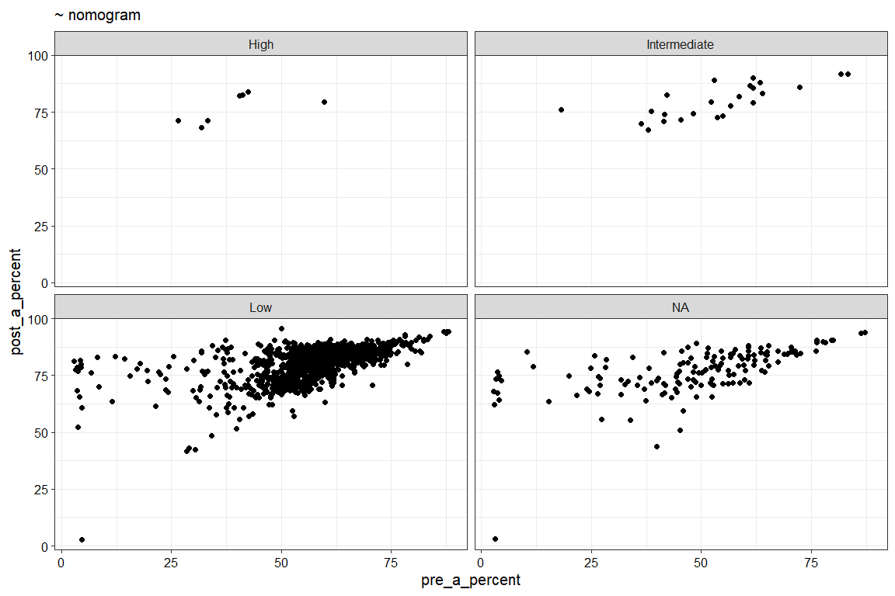
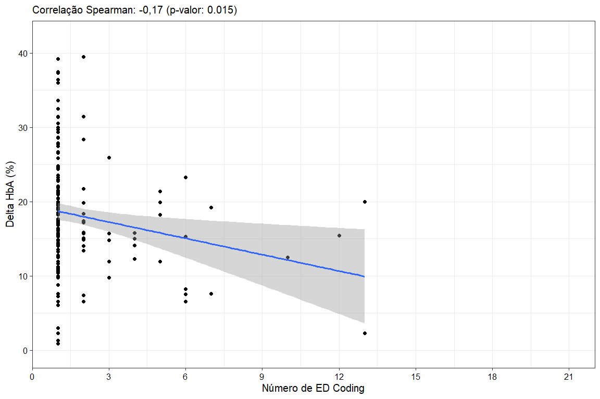
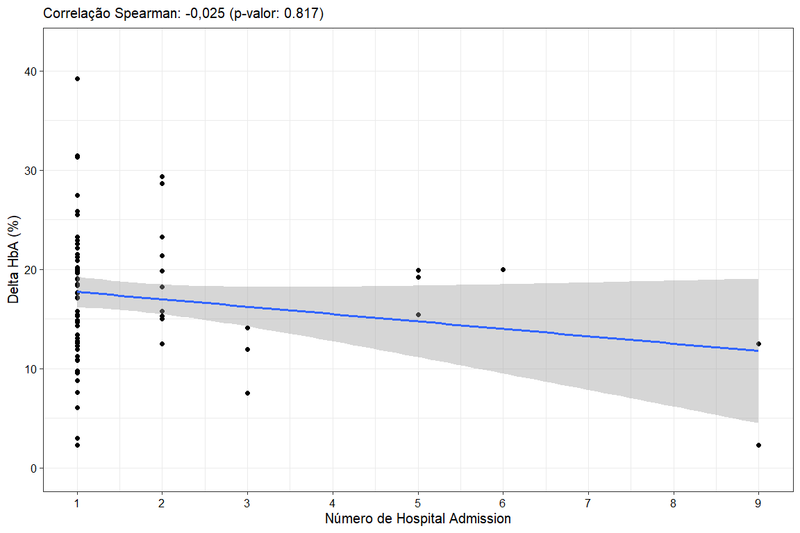
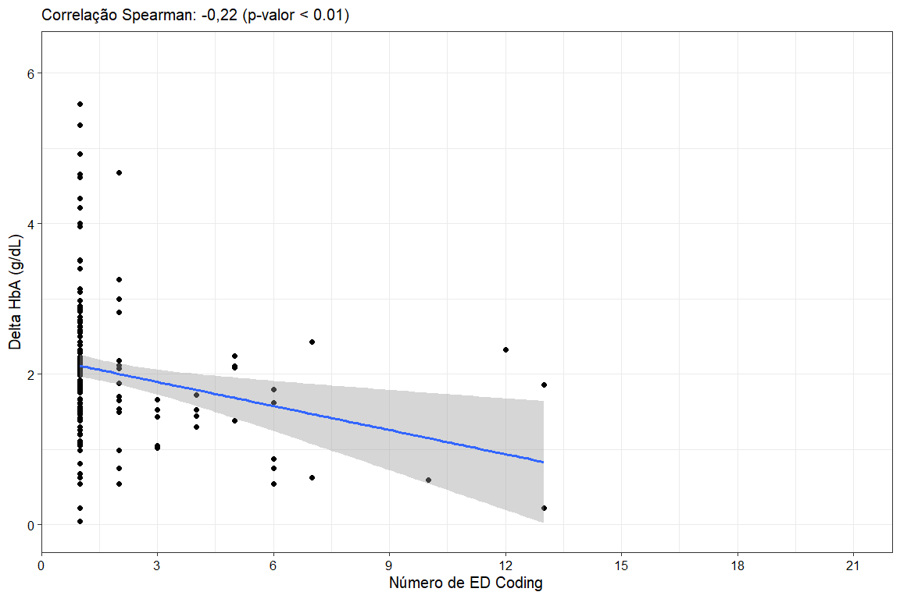
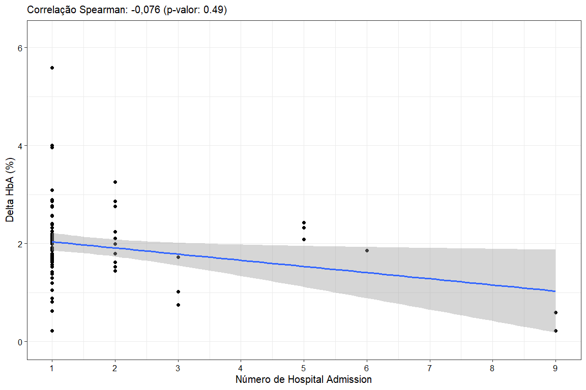
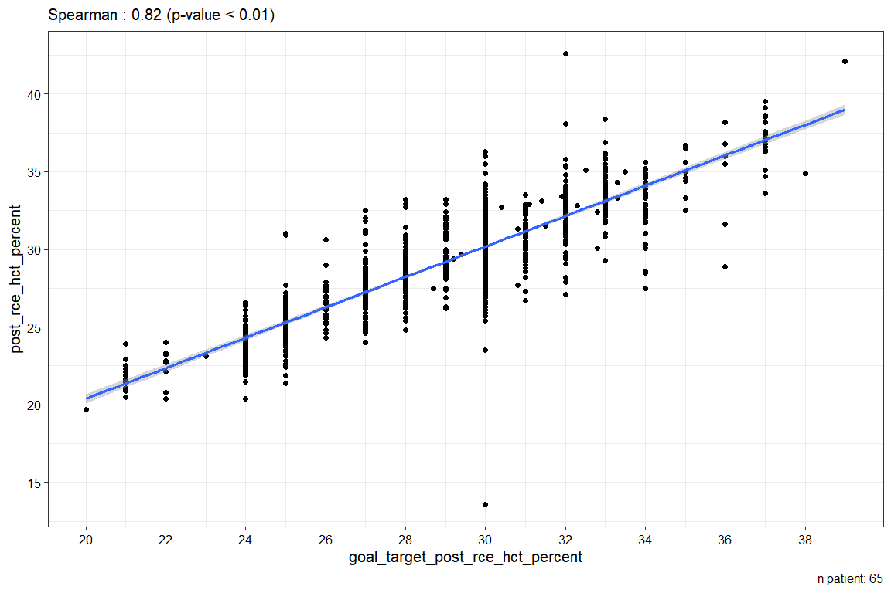

Every analysis above were execute using the language R version 4.5.1 (2025-06-13 ucrt) and o software IDE (Integrated Development Environment) RStudio. Also the reports in format PDF was development for library `rmarkdown`.

Welinton Yoshio Hirai^[wyhirai@gmail.com]


# Análise 1 - Nomograma



# Análise 2a - Verificar a correlação entre adminissão de Delta HBC (%)

Seleção dos dados de ED e Admission para os códigos 1, 2, 3, 4, …, 9; excluindo os códigos 10, 11, e 12;


```{=html}
<div class="tabwid"><style>.cl-3b7c93c4{}.cl-3b6de04a{font-family:'Arial';font-size:11pt;font-weight:normal;font-style:normal;text-decoration:none;color:rgba(0, 0, 0, 1.00);background-color:transparent;}.cl-3b795b46{margin:0;text-align:left;border-bottom: 0 solid rgba(0, 0, 0, 1.00);border-top: 0 solid rgba(0, 0, 0, 1.00);border-left: 0 solid rgba(0, 0, 0, 1.00);border-right: 0 solid rgba(0, 0, 0, 1.00);padding-bottom:5pt;padding-top:5pt;padding-left:5pt;padding-right:5pt;line-height: 1;background-color:transparent;}.cl-3b795b50{margin:0;text-align:right;border-bottom: 0 solid rgba(0, 0, 0, 1.00);border-top: 0 solid rgba(0, 0, 0, 1.00);border-left: 0 solid rgba(0, 0, 0, 1.00);border-right: 0 solid rgba(0, 0, 0, 1.00);padding-bottom:5pt;padding-top:5pt;padding-left:5pt;padding-right:5pt;line-height: 1;background-color:transparent;}.cl-3b7974dc{width:0.75in;background-color:transparent;vertical-align: middle;border-bottom: 1.5pt solid rgba(102, 102, 102, 1.00);border-top: 1.5pt solid rgba(102, 102, 102, 1.00);border-left: 0 solid rgba(0, 0, 0, 1.00);border-right: 0 solid rgba(0, 0, 0, 1.00);margin-bottom:0;margin-top:0;margin-left:0;margin-right:0;}.cl-3b7974dd{width:0.75in;background-color:transparent;vertical-align: middle;border-bottom: 1.5pt solid rgba(102, 102, 102, 1.00);border-top: 1.5pt solid rgba(102, 102, 102, 1.00);border-left: 0 solid rgba(0, 0, 0, 1.00);border-right: 0 solid rgba(0, 0, 0, 1.00);margin-bottom:0;margin-top:0;margin-left:0;margin-right:0;}.cl-3b7974e6{width:0.75in;background-color:transparent;vertical-align: middle;border-bottom: 0 solid rgba(0, 0, 0, 1.00);border-top: 0 solid rgba(0, 0, 0, 1.00);border-left: 0 solid rgba(0, 0, 0, 1.00);border-right: 0 solid rgba(0, 0, 0, 1.00);margin-bottom:0;margin-top:0;margin-left:0;margin-right:0;}.cl-3b7974e7{width:0.75in;background-color:transparent;vertical-align: middle;border-bottom: 0 solid rgba(0, 0, 0, 1.00);border-top: 0 solid rgba(0, 0, 0, 1.00);border-left: 0 solid rgba(0, 0, 0, 1.00);border-right: 0 solid rgba(0, 0, 0, 1.00);margin-bottom:0;margin-top:0;margin-left:0;margin-right:0;}.cl-3b7974f0{width:0.75in;background-color:transparent;vertical-align: middle;border-bottom: 1.5pt solid rgba(102, 102, 102, 1.00);border-top: 0 solid rgba(0, 0, 0, 1.00);border-left: 0 solid rgba(0, 0, 0, 1.00);border-right: 0 solid rgba(0, 0, 0, 1.00);margin-bottom:0;margin-top:0;margin-left:0;margin-right:0;}.cl-3b7974f1{width:0.75in;background-color:transparent;vertical-align: middle;border-bottom: 1.5pt solid rgba(102, 102, 102, 1.00);border-top: 0 solid rgba(0, 0, 0, 1.00);border-left: 0 solid rgba(0, 0, 0, 1.00);border-right: 0 solid rgba(0, 0, 0, 1.00);margin-bottom:0;margin-top:0;margin-left:0;margin-right:0;}</style><table data-quarto-disable-processing='true' class='cl-3b7c93c4'><caption style="display:table-caption;margin:0pt;text-align:center;border-bottom: 0.00pt solid transparent;border-top: 0.00pt solid transparent;border-left: 0.00pt solid transparent;border-right: 0.00pt solid transparent;padding-top:3pt;padding-bottom:3pt;padding-left:3pt;padding-right:3pt;line-height: 1;background-color:transparent;"><span>Tabela contagem ED Coding</span></caption><thead><tr style="overflow-wrap:break-word;"><th class="cl-3b7974dc"><p class="cl-3b795b46"><span class="cl-3b6de04a">value</span></p></th><th class="cl-3b7974dd"><p class="cl-3b795b50"><span class="cl-3b6de04a">n</span></p></th></tr></thead><tbody><tr style="overflow-wrap:break-word;"><td class="cl-3b7974e6"><p class="cl-3b795b46"><span class="cl-3b6de04a">1</span></p></td><td class="cl-3b7974e7"><p class="cl-3b795b50"><span class="cl-3b6de04a">276</span></p></td></tr><tr style="overflow-wrap:break-word;"><td class="cl-3b7974e6"><p class="cl-3b795b46"><span class="cl-3b6de04a">1a</span></p></td><td class="cl-3b7974e7"><p class="cl-3b795b50"><span class="cl-3b6de04a">8</span></p></td></tr><tr style="overflow-wrap:break-word;"><td class="cl-3b7974e6"><p class="cl-3b795b46"><span class="cl-3b6de04a">1b</span></p></td><td class="cl-3b7974e7"><p class="cl-3b795b50"><span class="cl-3b6de04a">31</span></p></td></tr><tr style="overflow-wrap:break-word;"><td class="cl-3b7974e6"><p class="cl-3b795b46"><span class="cl-3b6de04a">1c</span></p></td><td class="cl-3b7974e7"><p class="cl-3b795b50"><span class="cl-3b6de04a">5</span></p></td></tr><tr style="overflow-wrap:break-word;"><td class="cl-3b7974e6"><p class="cl-3b795b46"><span class="cl-3b6de04a">1d</span></p></td><td class="cl-3b7974e7"><p class="cl-3b795b50"><span class="cl-3b6de04a">1</span></p></td></tr><tr style="overflow-wrap:break-word;"><td class="cl-3b7974e6"><p class="cl-3b795b46"><span class="cl-3b6de04a">2</span></p></td><td class="cl-3b7974e7"><p class="cl-3b795b50"><span class="cl-3b6de04a">2</span></p></td></tr><tr style="overflow-wrap:break-word;"><td class="cl-3b7974e6"><p class="cl-3b795b46"><span class="cl-3b6de04a">2a</span></p></td><td class="cl-3b7974e7"><p class="cl-3b795b50"><span class="cl-3b6de04a">2</span></p></td></tr><tr style="overflow-wrap:break-word;"><td class="cl-3b7974e6"><p class="cl-3b795b46"><span class="cl-3b6de04a">2b</span></p></td><td class="cl-3b7974e7"><p class="cl-3b795b50"><span class="cl-3b6de04a">1</span></p></td></tr><tr style="overflow-wrap:break-word;"><td class="cl-3b7974e6"><p class="cl-3b795b46"><span class="cl-3b6de04a">2c</span></p></td><td class="cl-3b7974e7"><p class="cl-3b795b50"><span class="cl-3b6de04a">1</span></p></td></tr><tr style="overflow-wrap:break-word;"><td class="cl-3b7974e6"><p class="cl-3b795b46"><span class="cl-3b6de04a">2d</span></p></td><td class="cl-3b7974e7"><p class="cl-3b795b50"><span class="cl-3b6de04a">1</span></p></td></tr><tr style="overflow-wrap:break-word;"><td class="cl-3b7974e6"><p class="cl-3b795b46"><span class="cl-3b6de04a">3</span></p></td><td class="cl-3b7974e7"><p class="cl-3b795b50"><span class="cl-3b6de04a">2</span></p></td></tr><tr style="overflow-wrap:break-word;"><td class="cl-3b7974e6"><p class="cl-3b795b46"><span class="cl-3b6de04a">3a</span></p></td><td class="cl-3b7974e7"><p class="cl-3b795b50"><span class="cl-3b6de04a">4</span></p></td></tr><tr style="overflow-wrap:break-word;"><td class="cl-3b7974e6"><p class="cl-3b795b46"><span class="cl-3b6de04a">3b</span></p></td><td class="cl-3b7974e7"><p class="cl-3b795b50"><span class="cl-3b6de04a">15</span></p></td></tr><tr style="overflow-wrap:break-word;"><td class="cl-3b7974e6"><p class="cl-3b795b46"><span class="cl-3b6de04a">3c</span></p></td><td class="cl-3b7974e7"><p class="cl-3b795b50"><span class="cl-3b6de04a">5</span></p></td></tr><tr style="overflow-wrap:break-word;"><td class="cl-3b7974e6"><p class="cl-3b795b46"><span class="cl-3b6de04a">3d</span></p></td><td class="cl-3b7974e7"><p class="cl-3b795b50"><span class="cl-3b6de04a">2</span></p></td></tr><tr style="overflow-wrap:break-word;"><td class="cl-3b7974e6"><p class="cl-3b795b46"><span class="cl-3b6de04a">3e</span></p></td><td class="cl-3b7974e7"><p class="cl-3b795b50"><span class="cl-3b6de04a">1</span></p></td></tr><tr style="overflow-wrap:break-word;"><td class="cl-3b7974e6"><p class="cl-3b795b46"><span class="cl-3b6de04a">4</span></p></td><td class="cl-3b7974e7"><p class="cl-3b795b50"><span class="cl-3b6de04a">13</span></p></td></tr><tr style="overflow-wrap:break-word;"><td class="cl-3b7974e6"><p class="cl-3b795b46"><span class="cl-3b6de04a">5</span></p></td><td class="cl-3b7974e7"><p class="cl-3b795b50"><span class="cl-3b6de04a">2</span></p></td></tr><tr style="overflow-wrap:break-word;"><td class="cl-3b7974e6"><p class="cl-3b795b46"><span class="cl-3b6de04a">7</span></p></td><td class="cl-3b7974e7"><p class="cl-3b795b50"><span class="cl-3b6de04a">42</span></p></td></tr><tr style="overflow-wrap:break-word;"><td class="cl-3b7974e6"><p class="cl-3b795b46"><span class="cl-3b6de04a">7a</span></p></td><td class="cl-3b7974e7"><p class="cl-3b795b50"><span class="cl-3b6de04a">2</span></p></td></tr><tr style="overflow-wrap:break-word;"><td class="cl-3b7974e6"><p class="cl-3b795b46"><span class="cl-3b6de04a">7b</span></p></td><td class="cl-3b7974e7"><p class="cl-3b795b50"><span class="cl-3b6de04a">3</span></p></td></tr><tr style="overflow-wrap:break-word;"><td class="cl-3b7974e6"><p class="cl-3b795b46"><span class="cl-3b6de04a">7c</span></p></td><td class="cl-3b7974e7"><p class="cl-3b795b50"><span class="cl-3b6de04a">5</span></p></td></tr><tr style="overflow-wrap:break-word;"><td class="cl-3b7974e6"><p class="cl-3b795b46"><span class="cl-3b6de04a">8</span></p></td><td class="cl-3b7974e7"><p class="cl-3b795b50"><span class="cl-3b6de04a">2</span></p></td></tr><tr style="overflow-wrap:break-word;"><td class="cl-3b7974e6"><p class="cl-3b795b46"><span class="cl-3b6de04a">9</span></p></td><td class="cl-3b7974e7"><p class="cl-3b795b50"><span class="cl-3b6de04a">9</span></p></td></tr><tr style="overflow-wrap:break-word;"><td class="cl-3b7974e6"><p class="cl-3b795b46"><span class="cl-3b6de04a">9a</span></p></td><td class="cl-3b7974e7"><p class="cl-3b795b50"><span class="cl-3b6de04a">1</span></p></td></tr><tr style="overflow-wrap:break-word;"><td class="cl-3b7974e6"><p class="cl-3b795b46"><span class="cl-3b6de04a">9b</span></p></td><td class="cl-3b7974e7"><p class="cl-3b795b50"><span class="cl-3b6de04a">1</span></p></td></tr><tr style="overflow-wrap:break-word;"><td class="cl-3b7974f0"><p class="cl-3b795b46"><span class="cl-3b6de04a"></span></p></td><td class="cl-3b7974f1"><p class="cl-3b795b50"><span class="cl-3b6de04a">44,014</span></p></td></tr></tbody></table></div>
```


```
## # A tibble: 1 × 6
##   var1  var2       cor statistic     p method  
##   <chr> <chr>    <dbl>     <dbl> <dbl> <chr>   
## 1 n     DeltaHbA -0.17  1407753. 0.015 Spearman
```




```{=html}
<div class="tabwid"><style>.cl-3bd9659a{}.cl-3bd33dfa{font-family:'Arial';font-size:11pt;font-weight:normal;font-style:normal;text-decoration:none;color:rgba(0, 0, 0, 1.00);background-color:transparent;}.cl-3bd5ddb2{margin:0;text-align:left;border-bottom: 0 solid rgba(0, 0, 0, 1.00);border-top: 0 solid rgba(0, 0, 0, 1.00);border-left: 0 solid rgba(0, 0, 0, 1.00);border-right: 0 solid rgba(0, 0, 0, 1.00);padding-bottom:5pt;padding-top:5pt;padding-left:5pt;padding-right:5pt;line-height: 1;background-color:transparent;}.cl-3bd5ddc6{margin:0;text-align:right;border-bottom: 0 solid rgba(0, 0, 0, 1.00);border-top: 0 solid rgba(0, 0, 0, 1.00);border-left: 0 solid rgba(0, 0, 0, 1.00);border-right: 0 solid rgba(0, 0, 0, 1.00);padding-bottom:5pt;padding-top:5pt;padding-left:5pt;padding-right:5pt;line-height: 1;background-color:transparent;}.cl-3bd5f586{width:0.75in;background-color:transparent;vertical-align: middle;border-bottom: 1.5pt solid rgba(102, 102, 102, 1.00);border-top: 1.5pt solid rgba(102, 102, 102, 1.00);border-left: 0 solid rgba(0, 0, 0, 1.00);border-right: 0 solid rgba(0, 0, 0, 1.00);margin-bottom:0;margin-top:0;margin-left:0;margin-right:0;}.cl-3bd5f590{width:0.75in;background-color:transparent;vertical-align: middle;border-bottom: 1.5pt solid rgba(102, 102, 102, 1.00);border-top: 1.5pt solid rgba(102, 102, 102, 1.00);border-left: 0 solid rgba(0, 0, 0, 1.00);border-right: 0 solid rgba(0, 0, 0, 1.00);margin-bottom:0;margin-top:0;margin-left:0;margin-right:0;}.cl-3bd5f59a{width:0.75in;background-color:transparent;vertical-align: middle;border-bottom: 0 solid rgba(0, 0, 0, 1.00);border-top: 0 solid rgba(0, 0, 0, 1.00);border-left: 0 solid rgba(0, 0, 0, 1.00);border-right: 0 solid rgba(0, 0, 0, 1.00);margin-bottom:0;margin-top:0;margin-left:0;margin-right:0;}.cl-3bd5f5a4{width:0.75in;background-color:transparent;vertical-align: middle;border-bottom: 0 solid rgba(0, 0, 0, 1.00);border-top: 0 solid rgba(0, 0, 0, 1.00);border-left: 0 solid rgba(0, 0, 0, 1.00);border-right: 0 solid rgba(0, 0, 0, 1.00);margin-bottom:0;margin-top:0;margin-left:0;margin-right:0;}.cl-3bd5f5a5{width:0.75in;background-color:transparent;vertical-align: middle;border-bottom: 1.5pt solid rgba(102, 102, 102, 1.00);border-top: 0 solid rgba(0, 0, 0, 1.00);border-left: 0 solid rgba(0, 0, 0, 1.00);border-right: 0 solid rgba(0, 0, 0, 1.00);margin-bottom:0;margin-top:0;margin-left:0;margin-right:0;}.cl-3bd5f5ae{width:0.75in;background-color:transparent;vertical-align: middle;border-bottom: 1.5pt solid rgba(102, 102, 102, 1.00);border-top: 0 solid rgba(0, 0, 0, 1.00);border-left: 0 solid rgba(0, 0, 0, 1.00);border-right: 0 solid rgba(0, 0, 0, 1.00);margin-bottom:0;margin-top:0;margin-left:0;margin-right:0;}</style><table data-quarto-disable-processing='true' class='cl-3bd9659a'><caption style="display:table-caption;margin:0pt;text-align:center;border-bottom: 0.00pt solid transparent;border-top: 0.00pt solid transparent;border-left: 0.00pt solid transparent;border-right: 0.00pt solid transparent;padding-top:3pt;padding-bottom:3pt;padding-left:3pt;padding-right:3pt;line-height: 1;background-color:transparent;"><span>Tabela contagem Hospital Admission</span></caption><thead><tr style="overflow-wrap:break-word;"><th class="cl-3bd5f586"><p class="cl-3bd5ddb2"><span class="cl-3bd33dfa">value</span></p></th><th class="cl-3bd5f590"><p class="cl-3bd5ddc6"><span class="cl-3bd33dfa">n</span></p></th></tr></thead><tbody><tr style="overflow-wrap:break-word;"><td class="cl-3bd5f59a"><p class="cl-3bd5ddb2"><span class="cl-3bd33dfa">1</span></p></td><td class="cl-3bd5f5a4"><p class="cl-3bd5ddc6"><span class="cl-3bd33dfa">110</span></p></td></tr><tr style="overflow-wrap:break-word;"><td class="cl-3bd5f59a"><p class="cl-3bd5ddb2"><span class="cl-3bd33dfa">1a</span></p></td><td class="cl-3bd5f5a4"><p class="cl-3bd5ddc6"><span class="cl-3bd33dfa">2</span></p></td></tr><tr style="overflow-wrap:break-word;"><td class="cl-3bd5f59a"><p class="cl-3bd5ddb2"><span class="cl-3bd33dfa">1b</span></p></td><td class="cl-3bd5f5a4"><p class="cl-3bd5ddc6"><span class="cl-3bd33dfa">4</span></p></td></tr><tr style="overflow-wrap:break-word;"><td class="cl-3bd5f59a"><p class="cl-3bd5ddb2"><span class="cl-3bd33dfa">1c</span></p></td><td class="cl-3bd5f5a4"><p class="cl-3bd5ddc6"><span class="cl-3bd33dfa">5</span></p></td></tr><tr style="overflow-wrap:break-word;"><td class="cl-3bd5f59a"><p class="cl-3bd5ddb2"><span class="cl-3bd33dfa">2</span></p></td><td class="cl-3bd5f5a4"><p class="cl-3bd5ddc6"><span class="cl-3bd33dfa">4</span></p></td></tr><tr style="overflow-wrap:break-word;"><td class="cl-3bd5f59a"><p class="cl-3bd5ddb2"><span class="cl-3bd33dfa">2a</span></p></td><td class="cl-3bd5f5a4"><p class="cl-3bd5ddc6"><span class="cl-3bd33dfa">1</span></p></td></tr><tr style="overflow-wrap:break-word;"><td class="cl-3bd5f59a"><p class="cl-3bd5ddb2"><span class="cl-3bd33dfa">2c</span></p></td><td class="cl-3bd5f5a4"><p class="cl-3bd5ddc6"><span class="cl-3bd33dfa">1</span></p></td></tr><tr style="overflow-wrap:break-word;"><td class="cl-3bd5f59a"><p class="cl-3bd5ddb2"><span class="cl-3bd33dfa">2d</span></p></td><td class="cl-3bd5f5a4"><p class="cl-3bd5ddc6"><span class="cl-3bd33dfa">3</span></p></td></tr><tr style="overflow-wrap:break-word;"><td class="cl-3bd5f59a"><p class="cl-3bd5ddb2"><span class="cl-3bd33dfa">3a</span></p></td><td class="cl-3bd5f5a4"><p class="cl-3bd5ddc6"><span class="cl-3bd33dfa">8</span></p></td></tr><tr style="overflow-wrap:break-word;"><td class="cl-3bd5f59a"><p class="cl-3bd5ddb2"><span class="cl-3bd33dfa">3b</span></p></td><td class="cl-3bd5f5a4"><p class="cl-3bd5ddc6"><span class="cl-3bd33dfa">1</span></p></td></tr><tr style="overflow-wrap:break-word;"><td class="cl-3bd5f59a"><p class="cl-3bd5ddb2"><span class="cl-3bd33dfa">3c</span></p></td><td class="cl-3bd5f5a4"><p class="cl-3bd5ddc6"><span class="cl-3bd33dfa">1</span></p></td></tr><tr style="overflow-wrap:break-word;"><td class="cl-3bd5f59a"><p class="cl-3bd5ddb2"><span class="cl-3bd33dfa">3e</span></p></td><td class="cl-3bd5f5a4"><p class="cl-3bd5ddc6"><span class="cl-3bd33dfa">3</span></p></td></tr><tr style="overflow-wrap:break-word;"><td class="cl-3bd5f59a"><p class="cl-3bd5ddb2"><span class="cl-3bd33dfa">5</span></p></td><td class="cl-3bd5f5a4"><p class="cl-3bd5ddc6"><span class="cl-3bd33dfa">3</span></p></td></tr><tr style="overflow-wrap:break-word;"><td class="cl-3bd5f59a"><p class="cl-3bd5ddb2"><span class="cl-3bd33dfa">7</span></p></td><td class="cl-3bd5f5a4"><p class="cl-3bd5ddc6"><span class="cl-3bd33dfa">12</span></p></td></tr><tr style="overflow-wrap:break-word;"><td class="cl-3bd5f59a"><p class="cl-3bd5ddb2"><span class="cl-3bd33dfa">7a</span></p></td><td class="cl-3bd5f5a4"><p class="cl-3bd5ddc6"><span class="cl-3bd33dfa">1</span></p></td></tr><tr style="overflow-wrap:break-word;"><td class="cl-3bd5f59a"><p class="cl-3bd5ddb2"><span class="cl-3bd33dfa">7c</span></p></td><td class="cl-3bd5f5a4"><p class="cl-3bd5ddc6"><span class="cl-3bd33dfa">2</span></p></td></tr><tr style="overflow-wrap:break-word;"><td class="cl-3bd5f59a"><p class="cl-3bd5ddb2"><span class="cl-3bd33dfa">8</span></p></td><td class="cl-3bd5f5a4"><p class="cl-3bd5ddc6"><span class="cl-3bd33dfa">1</span></p></td></tr><tr style="overflow-wrap:break-word;"><td class="cl-3bd5f59a"><p class="cl-3bd5ddb2"><span class="cl-3bd33dfa">9</span></p></td><td class="cl-3bd5f5a4"><p class="cl-3bd5ddc6"><span class="cl-3bd33dfa">2</span></p></td></tr><tr style="overflow-wrap:break-word;"><td class="cl-3bd5f59a"><p class="cl-3bd5ddb2"><span class="cl-3bd33dfa">9a</span></p></td><td class="cl-3bd5f5a4"><p class="cl-3bd5ddc6"><span class="cl-3bd33dfa">1</span></p></td></tr><tr style="overflow-wrap:break-word;"><td class="cl-3bd5f5a5"><p class="cl-3bd5ddb2"><span class="cl-3bd33dfa"></span></p></td><td class="cl-3bd5f5ae"><p class="cl-3bd5ddc6"><span class="cl-3bd33dfa">20,070</span></p></td></tr></tbody></table></div>
```


```
## # A tibble: 1 × 6
##   var1  var2        cor statistic     p method  
##   <chr> <chr>     <dbl>     <dbl> <dbl> <chr>   
## 1 n     DeltaHbA -0.025   108679. 0.817 Spearman
```



# Análise 2a - Verificar a correlação entre adminissão de Delta HBC (g/dL)

Seleção dos dados de ED e Admission para os códigos 1, 2, 3, 4, …, 9; excluindo os códigos 10, 11, e 12;


```{=html}
<div class="tabwid"><style>.cl-3c14386e{}.cl-3c0f167c{font-family:'Arial';font-size:11pt;font-weight:normal;font-style:normal;text-decoration:none;color:rgba(0, 0, 0, 1.00);background-color:transparent;}.cl-3c110c34{margin:0;text-align:left;border-bottom: 0 solid rgba(0, 0, 0, 1.00);border-top: 0 solid rgba(0, 0, 0, 1.00);border-left: 0 solid rgba(0, 0, 0, 1.00);border-right: 0 solid rgba(0, 0, 0, 1.00);padding-bottom:5pt;padding-top:5pt;padding-left:5pt;padding-right:5pt;line-height: 1;background-color:transparent;}.cl-3c110c35{margin:0;text-align:right;border-bottom: 0 solid rgba(0, 0, 0, 1.00);border-top: 0 solid rgba(0, 0, 0, 1.00);border-left: 0 solid rgba(0, 0, 0, 1.00);border-right: 0 solid rgba(0, 0, 0, 1.00);padding-bottom:5pt;padding-top:5pt;padding-left:5pt;padding-right:5pt;line-height: 1;background-color:transparent;}.cl-3c111d14{width:0.75in;background-color:transparent;vertical-align: middle;border-bottom: 1.5pt solid rgba(102, 102, 102, 1.00);border-top: 1.5pt solid rgba(102, 102, 102, 1.00);border-left: 0 solid rgba(0, 0, 0, 1.00);border-right: 0 solid rgba(0, 0, 0, 1.00);margin-bottom:0;margin-top:0;margin-left:0;margin-right:0;}.cl-3c111d15{width:0.75in;background-color:transparent;vertical-align: middle;border-bottom: 1.5pt solid rgba(102, 102, 102, 1.00);border-top: 1.5pt solid rgba(102, 102, 102, 1.00);border-left: 0 solid rgba(0, 0, 0, 1.00);border-right: 0 solid rgba(0, 0, 0, 1.00);margin-bottom:0;margin-top:0;margin-left:0;margin-right:0;}.cl-3c111d1e{width:0.75in;background-color:transparent;vertical-align: middle;border-bottom: 0 solid rgba(0, 0, 0, 1.00);border-top: 0 solid rgba(0, 0, 0, 1.00);border-left: 0 solid rgba(0, 0, 0, 1.00);border-right: 0 solid rgba(0, 0, 0, 1.00);margin-bottom:0;margin-top:0;margin-left:0;margin-right:0;}.cl-3c111d1f{width:0.75in;background-color:transparent;vertical-align: middle;border-bottom: 0 solid rgba(0, 0, 0, 1.00);border-top: 0 solid rgba(0, 0, 0, 1.00);border-left: 0 solid rgba(0, 0, 0, 1.00);border-right: 0 solid rgba(0, 0, 0, 1.00);margin-bottom:0;margin-top:0;margin-left:0;margin-right:0;}.cl-3c111d20{width:0.75in;background-color:transparent;vertical-align: middle;border-bottom: 1.5pt solid rgba(102, 102, 102, 1.00);border-top: 0 solid rgba(0, 0, 0, 1.00);border-left: 0 solid rgba(0, 0, 0, 1.00);border-right: 0 solid rgba(0, 0, 0, 1.00);margin-bottom:0;margin-top:0;margin-left:0;margin-right:0;}.cl-3c111d28{width:0.75in;background-color:transparent;vertical-align: middle;border-bottom: 1.5pt solid rgba(102, 102, 102, 1.00);border-top: 0 solid rgba(0, 0, 0, 1.00);border-left: 0 solid rgba(0, 0, 0, 1.00);border-right: 0 solid rgba(0, 0, 0, 1.00);margin-bottom:0;margin-top:0;margin-left:0;margin-right:0;}</style><table data-quarto-disable-processing='true' class='cl-3c14386e'><caption style="display:table-caption;margin:0pt;text-align:center;border-bottom: 0.00pt solid transparent;border-top: 0.00pt solid transparent;border-left: 0.00pt solid transparent;border-right: 0.00pt solid transparent;padding-top:3pt;padding-bottom:3pt;padding-left:3pt;padding-right:3pt;line-height: 1;background-color:transparent;"><span>Tabela contagem ED Coding</span></caption><thead><tr style="overflow-wrap:break-word;"><th class="cl-3c111d14"><p class="cl-3c110c34"><span class="cl-3c0f167c">value</span></p></th><th class="cl-3c111d15"><p class="cl-3c110c35"><span class="cl-3c0f167c">n</span></p></th></tr></thead><tbody><tr style="overflow-wrap:break-word;"><td class="cl-3c111d1e"><p class="cl-3c110c34"><span class="cl-3c0f167c">1</span></p></td><td class="cl-3c111d1f"><p class="cl-3c110c35"><span class="cl-3c0f167c">276</span></p></td></tr><tr style="overflow-wrap:break-word;"><td class="cl-3c111d1e"><p class="cl-3c110c34"><span class="cl-3c0f167c">1a</span></p></td><td class="cl-3c111d1f"><p class="cl-3c110c35"><span class="cl-3c0f167c">8</span></p></td></tr><tr style="overflow-wrap:break-word;"><td class="cl-3c111d1e"><p class="cl-3c110c34"><span class="cl-3c0f167c">1b</span></p></td><td class="cl-3c111d1f"><p class="cl-3c110c35"><span class="cl-3c0f167c">31</span></p></td></tr><tr style="overflow-wrap:break-word;"><td class="cl-3c111d1e"><p class="cl-3c110c34"><span class="cl-3c0f167c">1c</span></p></td><td class="cl-3c111d1f"><p class="cl-3c110c35"><span class="cl-3c0f167c">5</span></p></td></tr><tr style="overflow-wrap:break-word;"><td class="cl-3c111d1e"><p class="cl-3c110c34"><span class="cl-3c0f167c">1d</span></p></td><td class="cl-3c111d1f"><p class="cl-3c110c35"><span class="cl-3c0f167c">1</span></p></td></tr><tr style="overflow-wrap:break-word;"><td class="cl-3c111d1e"><p class="cl-3c110c34"><span class="cl-3c0f167c">2</span></p></td><td class="cl-3c111d1f"><p class="cl-3c110c35"><span class="cl-3c0f167c">2</span></p></td></tr><tr style="overflow-wrap:break-word;"><td class="cl-3c111d1e"><p class="cl-3c110c34"><span class="cl-3c0f167c">2a</span></p></td><td class="cl-3c111d1f"><p class="cl-3c110c35"><span class="cl-3c0f167c">2</span></p></td></tr><tr style="overflow-wrap:break-word;"><td class="cl-3c111d1e"><p class="cl-3c110c34"><span class="cl-3c0f167c">2b</span></p></td><td class="cl-3c111d1f"><p class="cl-3c110c35"><span class="cl-3c0f167c">1</span></p></td></tr><tr style="overflow-wrap:break-word;"><td class="cl-3c111d1e"><p class="cl-3c110c34"><span class="cl-3c0f167c">2c</span></p></td><td class="cl-3c111d1f"><p class="cl-3c110c35"><span class="cl-3c0f167c">1</span></p></td></tr><tr style="overflow-wrap:break-word;"><td class="cl-3c111d1e"><p class="cl-3c110c34"><span class="cl-3c0f167c">2d</span></p></td><td class="cl-3c111d1f"><p class="cl-3c110c35"><span class="cl-3c0f167c">1</span></p></td></tr><tr style="overflow-wrap:break-word;"><td class="cl-3c111d1e"><p class="cl-3c110c34"><span class="cl-3c0f167c">3</span></p></td><td class="cl-3c111d1f"><p class="cl-3c110c35"><span class="cl-3c0f167c">2</span></p></td></tr><tr style="overflow-wrap:break-word;"><td class="cl-3c111d1e"><p class="cl-3c110c34"><span class="cl-3c0f167c">3a</span></p></td><td class="cl-3c111d1f"><p class="cl-3c110c35"><span class="cl-3c0f167c">4</span></p></td></tr><tr style="overflow-wrap:break-word;"><td class="cl-3c111d1e"><p class="cl-3c110c34"><span class="cl-3c0f167c">3b</span></p></td><td class="cl-3c111d1f"><p class="cl-3c110c35"><span class="cl-3c0f167c">15</span></p></td></tr><tr style="overflow-wrap:break-word;"><td class="cl-3c111d1e"><p class="cl-3c110c34"><span class="cl-3c0f167c">3c</span></p></td><td class="cl-3c111d1f"><p class="cl-3c110c35"><span class="cl-3c0f167c">5</span></p></td></tr><tr style="overflow-wrap:break-word;"><td class="cl-3c111d1e"><p class="cl-3c110c34"><span class="cl-3c0f167c">3d</span></p></td><td class="cl-3c111d1f"><p class="cl-3c110c35"><span class="cl-3c0f167c">2</span></p></td></tr><tr style="overflow-wrap:break-word;"><td class="cl-3c111d1e"><p class="cl-3c110c34"><span class="cl-3c0f167c">3e</span></p></td><td class="cl-3c111d1f"><p class="cl-3c110c35"><span class="cl-3c0f167c">1</span></p></td></tr><tr style="overflow-wrap:break-word;"><td class="cl-3c111d1e"><p class="cl-3c110c34"><span class="cl-3c0f167c">4</span></p></td><td class="cl-3c111d1f"><p class="cl-3c110c35"><span class="cl-3c0f167c">13</span></p></td></tr><tr style="overflow-wrap:break-word;"><td class="cl-3c111d1e"><p class="cl-3c110c34"><span class="cl-3c0f167c">5</span></p></td><td class="cl-3c111d1f"><p class="cl-3c110c35"><span class="cl-3c0f167c">2</span></p></td></tr><tr style="overflow-wrap:break-word;"><td class="cl-3c111d1e"><p class="cl-3c110c34"><span class="cl-3c0f167c">7</span></p></td><td class="cl-3c111d1f"><p class="cl-3c110c35"><span class="cl-3c0f167c">42</span></p></td></tr><tr style="overflow-wrap:break-word;"><td class="cl-3c111d1e"><p class="cl-3c110c34"><span class="cl-3c0f167c">7a</span></p></td><td class="cl-3c111d1f"><p class="cl-3c110c35"><span class="cl-3c0f167c">2</span></p></td></tr><tr style="overflow-wrap:break-word;"><td class="cl-3c111d1e"><p class="cl-3c110c34"><span class="cl-3c0f167c">7b</span></p></td><td class="cl-3c111d1f"><p class="cl-3c110c35"><span class="cl-3c0f167c">3</span></p></td></tr><tr style="overflow-wrap:break-word;"><td class="cl-3c111d1e"><p class="cl-3c110c34"><span class="cl-3c0f167c">7c</span></p></td><td class="cl-3c111d1f"><p class="cl-3c110c35"><span class="cl-3c0f167c">5</span></p></td></tr><tr style="overflow-wrap:break-word;"><td class="cl-3c111d1e"><p class="cl-3c110c34"><span class="cl-3c0f167c">8</span></p></td><td class="cl-3c111d1f"><p class="cl-3c110c35"><span class="cl-3c0f167c">2</span></p></td></tr><tr style="overflow-wrap:break-word;"><td class="cl-3c111d1e"><p class="cl-3c110c34"><span class="cl-3c0f167c">9</span></p></td><td class="cl-3c111d1f"><p class="cl-3c110c35"><span class="cl-3c0f167c">9</span></p></td></tr><tr style="overflow-wrap:break-word;"><td class="cl-3c111d1e"><p class="cl-3c110c34"><span class="cl-3c0f167c">9a</span></p></td><td class="cl-3c111d1f"><p class="cl-3c110c35"><span class="cl-3c0f167c">1</span></p></td></tr><tr style="overflow-wrap:break-word;"><td class="cl-3c111d1e"><p class="cl-3c110c34"><span class="cl-3c0f167c">9b</span></p></td><td class="cl-3c111d1f"><p class="cl-3c110c35"><span class="cl-3c0f167c">1</span></p></td></tr><tr style="overflow-wrap:break-word;"><td class="cl-3c111d20"><p class="cl-3c110c34"><span class="cl-3c0f167c"></span></p></td><td class="cl-3c111d28"><p class="cl-3c110c35"><span class="cl-3c0f167c">44,014</span></p></td></tr></tbody></table></div>
```


```
## # A tibble: 1 × 6
##   var1  var2           cor statistic       p method  
##   <chr> <chr>        <dbl>     <dbl>   <dbl> <chr>   
## 1 n     DeltaHbA_gdL -0.22  1397404. 0.00204 Spearman
```




```{=html}
<div class="tabwid"><style>.cl-3c44e3d8{}.cl-3c3f99b4{font-family:'Arial';font-size:11pt;font-weight:normal;font-style:normal;text-decoration:none;color:rgba(0, 0, 0, 1.00);background-color:transparent;}.cl-3c4192aa{margin:0;text-align:left;border-bottom: 0 solid rgba(0, 0, 0, 1.00);border-top: 0 solid rgba(0, 0, 0, 1.00);border-left: 0 solid rgba(0, 0, 0, 1.00);border-right: 0 solid rgba(0, 0, 0, 1.00);padding-bottom:5pt;padding-top:5pt;padding-left:5pt;padding-right:5pt;line-height: 1;background-color:transparent;}.cl-3c4192b4{margin:0;text-align:right;border-bottom: 0 solid rgba(0, 0, 0, 1.00);border-top: 0 solid rgba(0, 0, 0, 1.00);border-left: 0 solid rgba(0, 0, 0, 1.00);border-right: 0 solid rgba(0, 0, 0, 1.00);padding-bottom:5pt;padding-top:5pt;padding-left:5pt;padding-right:5pt;line-height: 1;background-color:transparent;}.cl-3c41a7f4{width:0.75in;background-color:transparent;vertical-align: middle;border-bottom: 1.5pt solid rgba(102, 102, 102, 1.00);border-top: 1.5pt solid rgba(102, 102, 102, 1.00);border-left: 0 solid rgba(0, 0, 0, 1.00);border-right: 0 solid rgba(0, 0, 0, 1.00);margin-bottom:0;margin-top:0;margin-left:0;margin-right:0;}.cl-3c41a7f5{width:0.75in;background-color:transparent;vertical-align: middle;border-bottom: 1.5pt solid rgba(102, 102, 102, 1.00);border-top: 1.5pt solid rgba(102, 102, 102, 1.00);border-left: 0 solid rgba(0, 0, 0, 1.00);border-right: 0 solid rgba(0, 0, 0, 1.00);margin-bottom:0;margin-top:0;margin-left:0;margin-right:0;}.cl-3c41a7f6{width:0.75in;background-color:transparent;vertical-align: middle;border-bottom: 0 solid rgba(0, 0, 0, 1.00);border-top: 0 solid rgba(0, 0, 0, 1.00);border-left: 0 solid rgba(0, 0, 0, 1.00);border-right: 0 solid rgba(0, 0, 0, 1.00);margin-bottom:0;margin-top:0;margin-left:0;margin-right:0;}.cl-3c41a7fe{width:0.75in;background-color:transparent;vertical-align: middle;border-bottom: 0 solid rgba(0, 0, 0, 1.00);border-top: 0 solid rgba(0, 0, 0, 1.00);border-left: 0 solid rgba(0, 0, 0, 1.00);border-right: 0 solid rgba(0, 0, 0, 1.00);margin-bottom:0;margin-top:0;margin-left:0;margin-right:0;}.cl-3c41a7ff{width:0.75in;background-color:transparent;vertical-align: middle;border-bottom: 1.5pt solid rgba(102, 102, 102, 1.00);border-top: 0 solid rgba(0, 0, 0, 1.00);border-left: 0 solid rgba(0, 0, 0, 1.00);border-right: 0 solid rgba(0, 0, 0, 1.00);margin-bottom:0;margin-top:0;margin-left:0;margin-right:0;}.cl-3c41a808{width:0.75in;background-color:transparent;vertical-align: middle;border-bottom: 1.5pt solid rgba(102, 102, 102, 1.00);border-top: 0 solid rgba(0, 0, 0, 1.00);border-left: 0 solid rgba(0, 0, 0, 1.00);border-right: 0 solid rgba(0, 0, 0, 1.00);margin-bottom:0;margin-top:0;margin-left:0;margin-right:0;}</style><table data-quarto-disable-processing='true' class='cl-3c44e3d8'><caption style="display:table-caption;margin:0pt;text-align:center;border-bottom: 0.00pt solid transparent;border-top: 0.00pt solid transparent;border-left: 0.00pt solid transparent;border-right: 0.00pt solid transparent;padding-top:3pt;padding-bottom:3pt;padding-left:3pt;padding-right:3pt;line-height: 1;background-color:transparent;"><span>Tabela contagem Hospital Admission</span></caption><thead><tr style="overflow-wrap:break-word;"><th class="cl-3c41a7f4"><p class="cl-3c4192aa"><span class="cl-3c3f99b4">value</span></p></th><th class="cl-3c41a7f5"><p class="cl-3c4192b4"><span class="cl-3c3f99b4">n</span></p></th></tr></thead><tbody><tr style="overflow-wrap:break-word;"><td class="cl-3c41a7f6"><p class="cl-3c4192aa"><span class="cl-3c3f99b4">1</span></p></td><td class="cl-3c41a7fe"><p class="cl-3c4192b4"><span class="cl-3c3f99b4">110</span></p></td></tr><tr style="overflow-wrap:break-word;"><td class="cl-3c41a7f6"><p class="cl-3c4192aa"><span class="cl-3c3f99b4">1a</span></p></td><td class="cl-3c41a7fe"><p class="cl-3c4192b4"><span class="cl-3c3f99b4">2</span></p></td></tr><tr style="overflow-wrap:break-word;"><td class="cl-3c41a7f6"><p class="cl-3c4192aa"><span class="cl-3c3f99b4">1b</span></p></td><td class="cl-3c41a7fe"><p class="cl-3c4192b4"><span class="cl-3c3f99b4">4</span></p></td></tr><tr style="overflow-wrap:break-word;"><td class="cl-3c41a7f6"><p class="cl-3c4192aa"><span class="cl-3c3f99b4">1c</span></p></td><td class="cl-3c41a7fe"><p class="cl-3c4192b4"><span class="cl-3c3f99b4">5</span></p></td></tr><tr style="overflow-wrap:break-word;"><td class="cl-3c41a7f6"><p class="cl-3c4192aa"><span class="cl-3c3f99b4">2</span></p></td><td class="cl-3c41a7fe"><p class="cl-3c4192b4"><span class="cl-3c3f99b4">4</span></p></td></tr><tr style="overflow-wrap:break-word;"><td class="cl-3c41a7f6"><p class="cl-3c4192aa"><span class="cl-3c3f99b4">2a</span></p></td><td class="cl-3c41a7fe"><p class="cl-3c4192b4"><span class="cl-3c3f99b4">1</span></p></td></tr><tr style="overflow-wrap:break-word;"><td class="cl-3c41a7f6"><p class="cl-3c4192aa"><span class="cl-3c3f99b4">2c</span></p></td><td class="cl-3c41a7fe"><p class="cl-3c4192b4"><span class="cl-3c3f99b4">1</span></p></td></tr><tr style="overflow-wrap:break-word;"><td class="cl-3c41a7f6"><p class="cl-3c4192aa"><span class="cl-3c3f99b4">2d</span></p></td><td class="cl-3c41a7fe"><p class="cl-3c4192b4"><span class="cl-3c3f99b4">3</span></p></td></tr><tr style="overflow-wrap:break-word;"><td class="cl-3c41a7f6"><p class="cl-3c4192aa"><span class="cl-3c3f99b4">3a</span></p></td><td class="cl-3c41a7fe"><p class="cl-3c4192b4"><span class="cl-3c3f99b4">8</span></p></td></tr><tr style="overflow-wrap:break-word;"><td class="cl-3c41a7f6"><p class="cl-3c4192aa"><span class="cl-3c3f99b4">3b</span></p></td><td class="cl-3c41a7fe"><p class="cl-3c4192b4"><span class="cl-3c3f99b4">1</span></p></td></tr><tr style="overflow-wrap:break-word;"><td class="cl-3c41a7f6"><p class="cl-3c4192aa"><span class="cl-3c3f99b4">3c</span></p></td><td class="cl-3c41a7fe"><p class="cl-3c4192b4"><span class="cl-3c3f99b4">1</span></p></td></tr><tr style="overflow-wrap:break-word;"><td class="cl-3c41a7f6"><p class="cl-3c4192aa"><span class="cl-3c3f99b4">3e</span></p></td><td class="cl-3c41a7fe"><p class="cl-3c4192b4"><span class="cl-3c3f99b4">3</span></p></td></tr><tr style="overflow-wrap:break-word;"><td class="cl-3c41a7f6"><p class="cl-3c4192aa"><span class="cl-3c3f99b4">5</span></p></td><td class="cl-3c41a7fe"><p class="cl-3c4192b4"><span class="cl-3c3f99b4">3</span></p></td></tr><tr style="overflow-wrap:break-word;"><td class="cl-3c41a7f6"><p class="cl-3c4192aa"><span class="cl-3c3f99b4">7</span></p></td><td class="cl-3c41a7fe"><p class="cl-3c4192b4"><span class="cl-3c3f99b4">12</span></p></td></tr><tr style="overflow-wrap:break-word;"><td class="cl-3c41a7f6"><p class="cl-3c4192aa"><span class="cl-3c3f99b4">7a</span></p></td><td class="cl-3c41a7fe"><p class="cl-3c4192b4"><span class="cl-3c3f99b4">1</span></p></td></tr><tr style="overflow-wrap:break-word;"><td class="cl-3c41a7f6"><p class="cl-3c4192aa"><span class="cl-3c3f99b4">7c</span></p></td><td class="cl-3c41a7fe"><p class="cl-3c4192b4"><span class="cl-3c3f99b4">2</span></p></td></tr><tr style="overflow-wrap:break-word;"><td class="cl-3c41a7f6"><p class="cl-3c4192aa"><span class="cl-3c3f99b4">8</span></p></td><td class="cl-3c41a7fe"><p class="cl-3c4192b4"><span class="cl-3c3f99b4">1</span></p></td></tr><tr style="overflow-wrap:break-word;"><td class="cl-3c41a7f6"><p class="cl-3c4192aa"><span class="cl-3c3f99b4">9</span></p></td><td class="cl-3c41a7fe"><p class="cl-3c4192b4"><span class="cl-3c3f99b4">2</span></p></td></tr><tr style="overflow-wrap:break-word;"><td class="cl-3c41a7f6"><p class="cl-3c4192aa"><span class="cl-3c3f99b4">9a</span></p></td><td class="cl-3c41a7fe"><p class="cl-3c4192b4"><span class="cl-3c3f99b4">1</span></p></td></tr><tr style="overflow-wrap:break-word;"><td class="cl-3c41a7ff"><p class="cl-3c4192aa"><span class="cl-3c3f99b4"></span></p></td><td class="cl-3c41a808"><p class="cl-3c4192b4"><span class="cl-3c3f99b4">20,070</span></p></td></tr></tbody></table></div>
```


```
## # A tibble: 1 × 6
##   var1  var2            cor statistic     p method  
##   <chr> <chr>         <dbl>     <dbl> <dbl> <chr>   
## 1 n     DeltaHbA_gdL -0.076   110101.  0.49 Spearman
```



# Análise 2b - Correlação entre nível de admissão para as variáveis de Goal/Target Post-RCE HCT (%) com Post-RCE HT (%);



# Análise 3 - created a variables rbc_antibodies_new que utiliza H/O RBC Allontibodies ? H/O RBC Autoantibodies e allob (1 = yes, 0 = no)


```{=html}
<div class="tabwid"><style>.cl-3c9d9776{}.cl-3c988b82{font-family:'Arial';font-size:11pt;font-weight:bold;font-style:normal;text-decoration:none;color:rgba(0, 0, 0, 1.00);background-color:transparent;}.cl-3c988b8c{font-family:'Arial';font-size:11pt;font-weight:normal;font-style:normal;text-decoration:none;color:rgba(0, 0, 0, 1.00);background-color:transparent;}.cl-3c9a8ef0{margin:0;text-align:left;border-bottom: 0 solid rgba(0, 0, 0, 1.00);border-top: 0 solid rgba(0, 0, 0, 1.00);border-left: 0 solid rgba(0, 0, 0, 1.00);border-right: 0 solid rgba(0, 0, 0, 1.00);padding-bottom:5pt;padding-top:5pt;padding-left:5pt;padding-right:5pt;line-height: 1;background-color:transparent;}.cl-3c9a8efa{margin:0;text-align:right;border-bottom: 0 solid rgba(0, 0, 0, 1.00);border-top: 0 solid rgba(0, 0, 0, 1.00);border-left: 0 solid rgba(0, 0, 0, 1.00);border-right: 0 solid rgba(0, 0, 0, 1.00);padding-bottom:5pt;padding-top:5pt;padding-left:5pt;padding-right:5pt;line-height: 1;background-color:transparent;}.cl-3c9aa11a{width:0.75in;background-color:transparent;vertical-align: middle;border-bottom: 1.5pt solid rgba(102, 102, 102, 1.00);border-top: 1.5pt solid rgba(102, 102, 102, 1.00);border-left: 0 solid rgba(0, 0, 0, 1.00);border-right: 0 solid rgba(0, 0, 0, 1.00);margin-bottom:0;margin-top:0;margin-left:0;margin-right:0;}.cl-3c9aa11b{width:0.75in;background-color:transparent;vertical-align: middle;border-bottom: 1.5pt solid rgba(102, 102, 102, 1.00);border-top: 1.5pt solid rgba(102, 102, 102, 1.00);border-left: 0 solid rgba(0, 0, 0, 1.00);border-right: 0 solid rgba(0, 0, 0, 1.00);margin-bottom:0;margin-top:0;margin-left:0;margin-right:0;}.cl-3c9aa124{width:0.75in;background-color:transparent;vertical-align: middle;border-bottom: 0.75pt solid rgba(102, 102, 102, 1.00);border-top: 0 solid rgba(0, 0, 0, 1.00);border-left: 0 solid rgba(0, 0, 0, 1.00);border-right: 0 solid rgba(0, 0, 0, 1.00);margin-bottom:0;margin-top:0;margin-left:0;margin-right:0;}.cl-3c9aa125{width:0.75in;background-color:transparent;vertical-align: middle;border-bottom: 0.75pt solid rgba(102, 102, 102, 1.00);border-top: 0 solid rgba(0, 0, 0, 1.00);border-left: 0 solid rgba(0, 0, 0, 1.00);border-right: 0 solid rgba(0, 0, 0, 1.00);margin-bottom:0;margin-top:0;margin-left:0;margin-right:0;}.cl-3c9aa12e{width:0.75in;background-color:transparent;vertical-align: middle;border-bottom: 0.75pt solid rgba(102, 102, 102, 1.00);border-top: 0.75pt solid rgba(102, 102, 102, 1.00);border-left: 0 solid rgba(0, 0, 0, 1.00);border-right: 0 solid rgba(0, 0, 0, 1.00);margin-bottom:0;margin-top:0;margin-left:0;margin-right:0;}.cl-3c9aa12f{width:0.75in;background-color:transparent;vertical-align: middle;border-bottom: 0.75pt solid rgba(102, 102, 102, 1.00);border-top: 0.75pt solid rgba(102, 102, 102, 1.00);border-left: 0 solid rgba(0, 0, 0, 1.00);border-right: 0 solid rgba(0, 0, 0, 1.00);margin-bottom:0;margin-top:0;margin-left:0;margin-right:0;}.cl-3c9aa130{width:0.75in;background-color:transparent;vertical-align: middle;border-bottom: 1.5pt solid rgba(102, 102, 102, 1.00);border-top: 0.75pt solid rgba(102, 102, 102, 1.00);border-left: 0 solid rgba(0, 0, 0, 1.00);border-right: 0 solid rgba(0, 0, 0, 1.00);margin-bottom:0;margin-top:0;margin-left:0;margin-right:0;}.cl-3c9aa138{width:0.75in;background-color:transparent;vertical-align: middle;border-bottom: 1.5pt solid rgba(102, 102, 102, 1.00);border-top: 0.75pt solid rgba(102, 102, 102, 1.00);border-left: 0 solid rgba(0, 0, 0, 1.00);border-right: 0 solid rgba(0, 0, 0, 1.00);margin-bottom:0;margin-top:0;margin-left:0;margin-right:0;}</style><table data-quarto-disable-processing='true' class='cl-3c9d9776'><caption style="display:table-caption;margin:0pt;text-align:center;border-bottom: 0.00pt solid transparent;border-top: 0.00pt solid transparent;border-left: 0.00pt solid transparent;border-right: 0.00pt solid transparent;padding-top:3pt;padding-bottom:3pt;padding-left:3pt;padding-right:3pt;line-height: 1;background-color:transparent;"><span>Nova variável</span></caption><thead><tr style="overflow-wrap:break-word;"><th class="cl-3c9aa11a"><p class="cl-3c9a8ef0"><span class="cl-3c988b82">rbc_antibodies_new</span></p></th><th class="cl-3c9aa11a"><p class="cl-3c9a8ef0"><span class="cl-3c988b82">h_o_rbc_alloantibodies</span></p></th><th class="cl-3c9aa11a"><p class="cl-3c9a8ef0"><span class="cl-3c988b82">h_o_rbc_autoantibodies</span></p></th><th class="cl-3c9aa11b"><p class="cl-3c9a8efa"><span class="cl-3c988b82">allo_ab_1_yes_0_no</span></p></th><th class="cl-3c9aa11b"><p class="cl-3c9a8efa"><span class="cl-3c988b82">n</span></p></th></tr></thead><tbody><tr style="overflow-wrap:break-word;"><td class="cl-3c9aa124"><p class="cl-3c9a8ef0"><span class="cl-3c988b8c">Group 1</span></p></td><td class="cl-3c9aa124"><p class="cl-3c9a8ef0"><span class="cl-3c988b8c">Yes</span></p></td><td class="cl-3c9aa124"><p class="cl-3c9a8ef0"><span class="cl-3c988b8c">No</span></p></td><td class="cl-3c9aa125"><p class="cl-3c9a8efa"><span class="cl-3c988b8c">0</span></p></td><td class="cl-3c9aa125"><p class="cl-3c9a8efa"><span class="cl-3c988b8c">2</span></p></td></tr><tr style="overflow-wrap:break-word;"><td class="cl-3c9aa12e"><p class="cl-3c9a8ef0"><span class="cl-3c988b8c">Group 1</span></p></td><td class="cl-3c9aa12e"><p class="cl-3c9a8ef0"><span class="cl-3c988b8c">Yes</span></p></td><td class="cl-3c9aa12e"><p class="cl-3c9a8ef0"><span class="cl-3c988b8c">Yes</span></p></td><td class="cl-3c9aa12f"><p class="cl-3c9a8efa"><span class="cl-3c988b8c">0</span></p></td><td class="cl-3c9aa12f"><p class="cl-3c9a8efa"><span class="cl-3c988b8c">2</span></p></td></tr><tr style="overflow-wrap:break-word;"><td class="cl-3c9aa12e"><p class="cl-3c9a8ef0"><span class="cl-3c988b8c">Group 3</span></p></td><td class="cl-3c9aa12e"><p class="cl-3c9a8ef0"><span class="cl-3c988b8c">Yes</span></p></td><td class="cl-3c9aa12e"><p class="cl-3c9a8ef0"><span class="cl-3c988b8c">No</span></p></td><td class="cl-3c9aa12f"><p class="cl-3c9a8efa"><span class="cl-3c988b8c">1</span></p></td><td class="cl-3c9aa12f"><p class="cl-3c9a8efa"><span class="cl-3c988b8c">17</span></p></td></tr><tr style="overflow-wrap:break-word;"><td class="cl-3c9aa12e"><p class="cl-3c9a8ef0"><span class="cl-3c988b8c">Group 3</span></p></td><td class="cl-3c9aa12e"><p class="cl-3c9a8ef0"><span class="cl-3c988b8c">Yes</span></p></td><td class="cl-3c9aa12e"><p class="cl-3c9a8ef0"><span class="cl-3c988b8c">Yes</span></p></td><td class="cl-3c9aa12f"><p class="cl-3c9a8efa"><span class="cl-3c988b8c">1</span></p></td><td class="cl-3c9aa12f"><p class="cl-3c9a8efa"><span class="cl-3c988b8c">10</span></p></td></tr><tr style="overflow-wrap:break-word;"><td class="cl-3c9aa130"><p class="cl-3c9a8ef0"><span class="cl-3c988b8c">Group 4</span></p></td><td class="cl-3c9aa130"><p class="cl-3c9a8ef0"><span class="cl-3c988b8c">No</span></p></td><td class="cl-3c9aa130"><p class="cl-3c9a8ef0"><span class="cl-3c988b8c">No</span></p></td><td class="cl-3c9aa138"><p class="cl-3c9a8efa"><span class="cl-3c988b8c">0</span></p></td><td class="cl-3c9aa138"><p class="cl-3c9a8efa"><span class="cl-3c988b8c">34</span></p></td></tr></tbody></table></div>
```

## Análise Univariada para Delta HBC (%)


```{=html}
<div class="tabwid"><style>.cl-3d79ea46{}.cl-3d741936{font-family:'Arial';font-size:11pt;font-weight:bold;font-style:normal;text-decoration:none;color:rgba(0, 0, 0, 1.00);background-color:transparent;}.cl-3d74194a{font-family:'Arial';font-size:11pt;font-weight:normal;font-style:normal;text-decoration:none;color:rgba(0, 0, 0, 1.00);background-color:transparent;}.cl-3d76417a{margin:0;text-align:left;border-bottom: 0 solid rgba(0, 0, 0, 1.00);border-top: 0 solid rgba(0, 0, 0, 1.00);border-left: 0 solid rgba(0, 0, 0, 1.00);border-right: 0 solid rgba(0, 0, 0, 1.00);padding-bottom:2pt;padding-top:2pt;padding-left:5pt;padding-right:5pt;line-height: 1;background-color:transparent;}.cl-3d764184{margin:0;text-align:left;border-bottom: 0 solid rgba(0, 0, 0, 1.00);border-top: 0 solid rgba(0, 0, 0, 1.00);border-left: 0 solid rgba(0, 0, 0, 1.00);border-right: 0 solid rgba(0, 0, 0, 1.00);padding-bottom:5pt;padding-top:5pt;padding-left:5pt;padding-right:5pt;line-height: 1;background-color:transparent;}.cl-3d764185{margin:0;text-align:left;border-bottom: 0 solid rgba(0, 0, 0, 1.00);border-top: 0 solid rgba(0, 0, 0, 1.00);border-left: 0 solid rgba(0, 0, 0, 1.00);border-right: 0 solid rgba(0, 0, 0, 1.00);padding-bottom:5pt;padding-top:5pt;padding-left:15pt;padding-right:5pt;line-height: 1;background-color:transparent;}.cl-3d76418e{margin:0;text-align:left;border-bottom: 0 solid rgba(0, 0, 0, 1.00);border-top: 0 solid rgba(0, 0, 0, 1.00);border-left: 0 solid rgba(0, 0, 0, 1.00);border-right: 0 solid rgba(0, 0, 0, 1.00);padding-bottom:5pt;padding-top:5pt;padding-left:5pt;padding-right:5pt;line-height: 1;background-color:transparent;}.cl-3d7654da{width:1.644in;background-color:transparent;vertical-align: middle;border-bottom: 1.5pt solid rgba(102, 102, 102, 1.00);border-top: 1.5pt solid rgba(102, 102, 102, 1.00);border-left: 0 solid rgba(0, 0, 0, 1.00);border-right: 0 solid rgba(0, 0, 0, 1.00);margin-bottom:0;margin-top:0;margin-left:0;margin-right:0;}.cl-3d7654e4{width:0.455in;background-color:transparent;vertical-align: middle;border-bottom: 1.5pt solid rgba(102, 102, 102, 1.00);border-top: 1.5pt solid rgba(102, 102, 102, 1.00);border-left: 0 solid rgba(0, 0, 0, 1.00);border-right: 0 solid rgba(0, 0, 0, 1.00);margin-bottom:0;margin-top:0;margin-left:0;margin-right:0;}.cl-3d7654e5{width:0.616in;background-color:transparent;vertical-align: middle;border-bottom: 1.5pt solid rgba(102, 102, 102, 1.00);border-top: 1.5pt solid rgba(102, 102, 102, 1.00);border-left: 0 solid rgba(0, 0, 0, 1.00);border-right: 0 solid rgba(0, 0, 0, 1.00);margin-bottom:0;margin-top:0;margin-left:0;margin-right:0;}.cl-3d7654e6{width:0.846in;background-color:transparent;vertical-align: middle;border-bottom: 1.5pt solid rgba(102, 102, 102, 1.00);border-top: 1.5pt solid rgba(102, 102, 102, 1.00);border-left: 0 solid rgba(0, 0, 0, 1.00);border-right: 0 solid rgba(0, 0, 0, 1.00);margin-bottom:0;margin-top:0;margin-left:0;margin-right:0;}.cl-3d7654ee{width:0.82in;background-color:transparent;vertical-align: middle;border-bottom: 1.5pt solid rgba(102, 102, 102, 1.00);border-top: 1.5pt solid rgba(102, 102, 102, 1.00);border-left: 0 solid rgba(0, 0, 0, 1.00);border-right: 0 solid rgba(0, 0, 0, 1.00);margin-bottom:0;margin-top:0;margin-left:0;margin-right:0;}.cl-3d7654ef{width:1.644in;background-color:transparent;vertical-align: top;border-bottom: 0.75pt solid rgba(102, 102, 102, 1.00);border-top: 0 solid rgba(0, 0, 0, 1.00);border-left: 0 solid rgba(0, 0, 0, 1.00);border-right: 0 solid rgba(0, 0, 0, 1.00);margin-bottom:0;margin-top:0;margin-left:0;margin-right:0;}.cl-3d7654f8{width:0.455in;background-color:transparent;vertical-align: top;border-bottom: 0.75pt solid rgba(102, 102, 102, 1.00);border-top: 0 solid rgba(0, 0, 0, 1.00);border-left: 0 solid rgba(0, 0, 0, 1.00);border-right: 0 solid rgba(0, 0, 0, 1.00);margin-bottom:0;margin-top:0;margin-left:0;margin-right:0;}.cl-3d7654f9{width:0.616in;background-color:transparent;vertical-align: top;border-bottom: 0.75pt solid rgba(102, 102, 102, 1.00);border-top: 0 solid rgba(0, 0, 0, 1.00);border-left: 0 solid rgba(0, 0, 0, 1.00);border-right: 0 solid rgba(0, 0, 0, 1.00);margin-bottom:0;margin-top:0;margin-left:0;margin-right:0;}.cl-3d765502{width:0.846in;background-color:transparent;vertical-align: top;border-bottom: 0.75pt solid rgba(102, 102, 102, 1.00);border-top: 0 solid rgba(0, 0, 0, 1.00);border-left: 0 solid rgba(0, 0, 0, 1.00);border-right: 0 solid rgba(0, 0, 0, 1.00);margin-bottom:0;margin-top:0;margin-left:0;margin-right:0;}.cl-3d76550c{width:0.82in;background-color:transparent;vertical-align: top;border-bottom: 0.75pt solid rgba(102, 102, 102, 1.00);border-top: 0 solid rgba(0, 0, 0, 1.00);border-left: 0 solid rgba(0, 0, 0, 1.00);border-right: 0 solid rgba(0, 0, 0, 1.00);margin-bottom:0;margin-top:0;margin-left:0;margin-right:0;}.cl-3d765516{width:1.644in;background-color:transparent;vertical-align: top;border-bottom: 0.75pt solid rgba(102, 102, 102, 1.00);border-top: 0.75pt solid rgba(102, 102, 102, 1.00);border-left: 0 solid rgba(0, 0, 0, 1.00);border-right: 0 solid rgba(0, 0, 0, 1.00);margin-bottom:0;margin-top:0;margin-left:0;margin-right:0;}.cl-3d765517{width:0.455in;background-color:transparent;vertical-align: top;border-bottom: 0.75pt solid rgba(102, 102, 102, 1.00);border-top: 0.75pt solid rgba(102, 102, 102, 1.00);border-left: 0 solid rgba(0, 0, 0, 1.00);border-right: 0 solid rgba(0, 0, 0, 1.00);margin-bottom:0;margin-top:0;margin-left:0;margin-right:0;}.cl-3d765518{width:0.616in;background-color:transparent;vertical-align: top;border-bottom: 0.75pt solid rgba(102, 102, 102, 1.00);border-top: 0.75pt solid rgba(102, 102, 102, 1.00);border-left: 0 solid rgba(0, 0, 0, 1.00);border-right: 0 solid rgba(0, 0, 0, 1.00);margin-bottom:0;margin-top:0;margin-left:0;margin-right:0;}.cl-3d765519{width:0.846in;background-color:transparent;vertical-align: top;border-bottom: 0.75pt solid rgba(102, 102, 102, 1.00);border-top: 0.75pt solid rgba(102, 102, 102, 1.00);border-left: 0 solid rgba(0, 0, 0, 1.00);border-right: 0 solid rgba(0, 0, 0, 1.00);margin-bottom:0;margin-top:0;margin-left:0;margin-right:0;}.cl-3d765520{width:0.82in;background-color:transparent;vertical-align: top;border-bottom: 0.75pt solid rgba(102, 102, 102, 1.00);border-top: 0.75pt solid rgba(102, 102, 102, 1.00);border-left: 0 solid rgba(0, 0, 0, 1.00);border-right: 0 solid rgba(0, 0, 0, 1.00);margin-bottom:0;margin-top:0;margin-left:0;margin-right:0;}.cl-3d76552a{width:1.644in;background-color:transparent;vertical-align: top;border-bottom: 1.5pt solid rgba(102, 102, 102, 1.00);border-top: 0.75pt solid rgba(102, 102, 102, 1.00);border-left: 0 solid rgba(0, 0, 0, 1.00);border-right: 0 solid rgba(0, 0, 0, 1.00);margin-bottom:0;margin-top:0;margin-left:0;margin-right:0;}.cl-3d76552b{width:0.455in;background-color:transparent;vertical-align: top;border-bottom: 1.5pt solid rgba(102, 102, 102, 1.00);border-top: 0.75pt solid rgba(102, 102, 102, 1.00);border-left: 0 solid rgba(0, 0, 0, 1.00);border-right: 0 solid rgba(0, 0, 0, 1.00);margin-bottom:0;margin-top:0;margin-left:0;margin-right:0;}.cl-3d76552c{width:0.616in;background-color:transparent;vertical-align: top;border-bottom: 1.5pt solid rgba(102, 102, 102, 1.00);border-top: 0.75pt solid rgba(102, 102, 102, 1.00);border-left: 0 solid rgba(0, 0, 0, 1.00);border-right: 0 solid rgba(0, 0, 0, 1.00);margin-bottom:0;margin-top:0;margin-left:0;margin-right:0;}.cl-3d765534{width:0.846in;background-color:transparent;vertical-align: top;border-bottom: 1.5pt solid rgba(102, 102, 102, 1.00);border-top: 0.75pt solid rgba(102, 102, 102, 1.00);border-left: 0 solid rgba(0, 0, 0, 1.00);border-right: 0 solid rgba(0, 0, 0, 1.00);margin-bottom:0;margin-top:0;margin-left:0;margin-right:0;}.cl-3d765535{width:0.82in;background-color:transparent;vertical-align: top;border-bottom: 1.5pt solid rgba(102, 102, 102, 1.00);border-top: 0.75pt solid rgba(102, 102, 102, 1.00);border-left: 0 solid rgba(0, 0, 0, 1.00);border-right: 0 solid rgba(0, 0, 0, 1.00);margin-bottom:0;margin-top:0;margin-left:0;margin-right:0;}.cl-3d765536{width:1.644in;background-color:transparent;vertical-align: middle;border-bottom: 0.75pt solid rgba(102, 102, 102, 1.00);border-top: 0 solid rgba(0, 0, 0, 1.00);border-left: 0 solid rgba(0, 0, 0, 1.00);border-right: 0 solid rgba(0, 0, 0, 1.00);margin-bottom:0;margin-top:0;margin-left:0;margin-right:0;}.cl-3d765537{width:0.455in;background-color:transparent;vertical-align: middle;border-bottom: 0.75pt solid rgba(102, 102, 102, 1.00);border-top: 0 solid rgba(0, 0, 0, 1.00);border-left: 0 solid rgba(0, 0, 0, 1.00);border-right: 0 solid rgba(0, 0, 0, 1.00);margin-bottom:0;margin-top:0;margin-left:0;margin-right:0;}.cl-3d76553e{width:0.616in;background-color:transparent;vertical-align: middle;border-bottom: 0.75pt solid rgba(102, 102, 102, 1.00);border-top: 0 solid rgba(0, 0, 0, 1.00);border-left: 0 solid rgba(0, 0, 0, 1.00);border-right: 0 solid rgba(0, 0, 0, 1.00);margin-bottom:0;margin-top:0;margin-left:0;margin-right:0;}.cl-3d765548{width:0.846in;background-color:transparent;vertical-align: middle;border-bottom: 0.75pt solid rgba(102, 102, 102, 1.00);border-top: 0 solid rgba(0, 0, 0, 1.00);border-left: 0 solid rgba(0, 0, 0, 1.00);border-right: 0 solid rgba(0, 0, 0, 1.00);margin-bottom:0;margin-top:0;margin-left:0;margin-right:0;}.cl-3d765549{width:0.82in;background-color:transparent;vertical-align: middle;border-bottom: 0.75pt solid rgba(102, 102, 102, 1.00);border-top: 0 solid rgba(0, 0, 0, 1.00);border-left: 0 solid rgba(0, 0, 0, 1.00);border-right: 0 solid rgba(0, 0, 0, 1.00);margin-bottom:0;margin-top:0;margin-left:0;margin-right:0;}</style><table data-quarto-disable-processing='true' class='cl-3d79ea46'><caption style="display:table-caption;margin:0pt;text-align:center;border-bottom: 0.00pt solid transparent;border-top: 0.00pt solid transparent;border-left: 0.00pt solid transparent;border-right: 0.00pt solid transparent;padding-top:3pt;padding-bottom:3pt;padding-left:3pt;padding-right:3pt;line-height: 1;background-color:transparent;"><span>Modelo de regressão linear simples</span></caption><thead><tr style="overflow-wrap:break-word;"><th class="cl-3d7654da"><p class="cl-3d76417a"><span class="cl-3d741936">Covariables</span></p></th><th class="cl-3d7654e4"><p class="cl-3d76417a"><span class="cl-3d741936">N</span></p></th><th class="cl-3d7654e5"><p class="cl-3d76417a"><span class="cl-3d741936">Beta</span></p></th><th class="cl-3d7654e6"><p class="cl-3d76417a"><span class="cl-3d741936">95% CI</span></p></th><th class="cl-3d7654ee"><p class="cl-3d76417a"><span class="cl-3d741936">p-value</span></p></th></tr></thead><tbody><tr style="overflow-wrap:break-word;"><td class="cl-3d7654ef"><p class="cl-3d764184"><span class="cl-3d741936">rbc_antibodies_new</span></p></td><td class="cl-3d7654f8"><p class="cl-3d764184"><span class="cl-3d74194a">65</span></p></td><td class="cl-3d7654f9"><p class="cl-3d764184"><span class="cl-3d74194a"></span></p></td><td class="cl-3d765502"><p class="cl-3d764184"><span class="cl-3d74194a"></span></p></td><td class="cl-3d76550c"><p class="cl-3d764184"><span class="cl-3d74194a"></span></p></td></tr><tr style="overflow-wrap:break-word;"><td class="cl-3d765516"><p class="cl-3d764185"><span class="cl-3d74194a">Group 1</span></p></td><td class="cl-3d765517"><p class="cl-3d764184"><span class="cl-3d74194a"></span></p></td><td class="cl-3d765518"><p class="cl-3d764184"><span class="cl-3d74194a">—</span></p></td><td class="cl-3d765519"><p class="cl-3d764184"><span class="cl-3d74194a">—</span></p></td><td class="cl-3d765520"><p class="cl-3d764184"><span class="cl-3d74194a"></span></p></td></tr><tr style="overflow-wrap:break-word;"><td class="cl-3d765516"><p class="cl-3d764185"><span class="cl-3d74194a">Group 3</span></p></td><td class="cl-3d765517"><p class="cl-3d764184"><span class="cl-3d74194a"></span></p></td><td class="cl-3d765518"><p class="cl-3d764184"><span class="cl-3d74194a">0.45</span></p></td><td class="cl-3d765519"><p class="cl-3d764184"><span class="cl-3d74194a">-5.0, 5.9</span></p></td><td class="cl-3d765520"><p class="cl-3d764184"><span class="cl-3d74194a">0.9</span></p></td></tr><tr style="overflow-wrap:break-word;"><td class="cl-3d76552a"><p class="cl-3d764185"><span class="cl-3d74194a">Group 4</span></p></td><td class="cl-3d76552b"><p class="cl-3d764184"><span class="cl-3d74194a"></span></p></td><td class="cl-3d76552c"><p class="cl-3d764184"><span class="cl-3d74194a">0.53</span></p></td><td class="cl-3d765534"><p class="cl-3d764184"><span class="cl-3d74194a">-4.8, 5.9</span></p></td><td class="cl-3d765535"><p class="cl-3d764184"><span class="cl-3d74194a">0.8</span></p></td></tr></tbody><tfoot><tr style="overflow-wrap:break-word;"><td  colspan="5"class="cl-3d765536"><p class="cl-3d76418e"><span class="cl-3d74194a">Abbreviation: CI = Confidence Interval</span></p></td></tr></tfoot></table></div>
```

# Análise 4 - Created new group to SCD Genotype. Excluding HbS beta Indianopolis, Other e sickle cell beta plus thalassemia and grouped S/beta zero thalassemia with SS for Group 1, and SS for group 2 (SCD_genotype_2CAT)

O paciente 52 era o único que tinha gene: _S/beta zero thalassemia_


```{=html}
<div class="tabwid"><style>.cl-3d85a16a{}.cl-3d8037b6{font-family:'Arial';font-size:11pt;font-weight:bold;font-style:normal;text-decoration:none;color:rgba(0, 0, 0, 1.00);background-color:transparent;}.cl-3d8037ca{font-family:'Arial';font-size:11pt;font-weight:normal;font-style:normal;text-decoration:none;color:rgba(0, 0, 0, 1.00);background-color:transparent;}.cl-3d824916{margin:0;text-align:left;border-bottom: 0 solid rgba(0, 0, 0, 1.00);border-top: 0 solid rgba(0, 0, 0, 1.00);border-left: 0 solid rgba(0, 0, 0, 1.00);border-right: 0 solid rgba(0, 0, 0, 1.00);padding-bottom:5pt;padding-top:5pt;padding-left:5pt;padding-right:5pt;line-height: 1;background-color:transparent;}.cl-3d824917{margin:0;text-align:right;border-bottom: 0 solid rgba(0, 0, 0, 1.00);border-top: 0 solid rgba(0, 0, 0, 1.00);border-left: 0 solid rgba(0, 0, 0, 1.00);border-right: 0 solid rgba(0, 0, 0, 1.00);padding-bottom:5pt;padding-top:5pt;padding-left:5pt;padding-right:5pt;line-height: 1;background-color:transparent;}.cl-3d825dde{width:0.75in;background-color:transparent;vertical-align: middle;border-bottom: 1.5pt solid rgba(102, 102, 102, 1.00);border-top: 1.5pt solid rgba(102, 102, 102, 1.00);border-left: 0 solid rgba(0, 0, 0, 1.00);border-right: 0 solid rgba(0, 0, 0, 1.00);margin-bottom:0;margin-top:0;margin-left:0;margin-right:0;}.cl-3d825de8{width:0.75in;background-color:transparent;vertical-align: middle;border-bottom: 1.5pt solid rgba(102, 102, 102, 1.00);border-top: 1.5pt solid rgba(102, 102, 102, 1.00);border-left: 0 solid rgba(0, 0, 0, 1.00);border-right: 0 solid rgba(0, 0, 0, 1.00);margin-bottom:0;margin-top:0;margin-left:0;margin-right:0;}.cl-3d825de9{width:0.75in;background-color:transparent;vertical-align: middle;border-bottom: 0.75pt solid rgba(102, 102, 102, 1.00);border-top: 0 solid rgba(0, 0, 0, 1.00);border-left: 0 solid rgba(0, 0, 0, 1.00);border-right: 0 solid rgba(0, 0, 0, 1.00);margin-bottom:0;margin-top:0;margin-left:0;margin-right:0;}.cl-3d825dea{width:0.75in;background-color:transparent;vertical-align: middle;border-bottom: 0.75pt solid rgba(102, 102, 102, 1.00);border-top: 0 solid rgba(0, 0, 0, 1.00);border-left: 0 solid rgba(0, 0, 0, 1.00);border-right: 0 solid rgba(0, 0, 0, 1.00);margin-bottom:0;margin-top:0;margin-left:0;margin-right:0;}.cl-3d825deb{width:0.75in;background-color:transparent;vertical-align: middle;border-bottom: 0.75pt solid rgba(102, 102, 102, 1.00);border-top: 0.75pt solid rgba(102, 102, 102, 1.00);border-left: 0 solid rgba(0, 0, 0, 1.00);border-right: 0 solid rgba(0, 0, 0, 1.00);margin-bottom:0;margin-top:0;margin-left:0;margin-right:0;}.cl-3d825df2{width:0.75in;background-color:transparent;vertical-align: middle;border-bottom: 0.75pt solid rgba(102, 102, 102, 1.00);border-top: 0.75pt solid rgba(102, 102, 102, 1.00);border-left: 0 solid rgba(0, 0, 0, 1.00);border-right: 0 solid rgba(0, 0, 0, 1.00);margin-bottom:0;margin-top:0;margin-left:0;margin-right:0;}.cl-3d825df3{width:0.75in;background-color:transparent;vertical-align: middle;border-bottom: 1.5pt solid rgba(102, 102, 102, 1.00);border-top: 0.75pt solid rgba(102, 102, 102, 1.00);border-left: 0 solid rgba(0, 0, 0, 1.00);border-right: 0 solid rgba(0, 0, 0, 1.00);margin-bottom:0;margin-top:0;margin-left:0;margin-right:0;}.cl-3d825dfc{width:0.75in;background-color:transparent;vertical-align: middle;border-bottom: 1.5pt solid rgba(102, 102, 102, 1.00);border-top: 0.75pt solid rgba(102, 102, 102, 1.00);border-left: 0 solid rgba(0, 0, 0, 1.00);border-right: 0 solid rgba(0, 0, 0, 1.00);margin-bottom:0;margin-top:0;margin-left:0;margin-right:0;}</style><table data-quarto-disable-processing='true' class='cl-3d85a16a'><thead><tr style="overflow-wrap:break-word;"><th class="cl-3d825dde"><p class="cl-3d824916"><span class="cl-3d8037b6">SCD_genotype_2CAT</span></p></th><th class="cl-3d825dde"><p class="cl-3d824916"><span class="cl-3d8037b6">scd_genotype_32</span></p></th><th class="cl-3d825de8"><p class="cl-3d824917"><span class="cl-3d8037b6">n</span></p></th></tr></thead><tbody><tr style="overflow-wrap:break-word;"><td class="cl-3d825de9"><p class="cl-3d824916"><span class="cl-3d8037ca">Group 1 - SS/SBO thal</span></p></td><td class="cl-3d825de9"><p class="cl-3d824916"><span class="cl-3d8037ca">SB0 thal</span></p></td><td class="cl-3d825dea"><p class="cl-3d824917"><span class="cl-3d8037ca">3</span></p></td></tr><tr style="overflow-wrap:break-word;"><td class="cl-3d825deb"><p class="cl-3d824916"><span class="cl-3d8037ca">Group 1 - SS/SBO thal</span></p></td><td class="cl-3d825deb"><p class="cl-3d824916"><span class="cl-3d8037ca">SS</span></p></td><td class="cl-3d825df2"><p class="cl-3d824917"><span class="cl-3d8037ca">56</span></p></td></tr><tr style="overflow-wrap:break-word;"><td class="cl-3d825deb"><p class="cl-3d824916"><span class="cl-3d8037ca">Group 2 - SC</span></p></td><td class="cl-3d825deb"><p class="cl-3d824916"><span class="cl-3d8037ca">SC</span></p></td><td class="cl-3d825df2"><p class="cl-3d824917"><span class="cl-3d8037ca">3</span></p></td></tr><tr style="overflow-wrap:break-word;"><td class="cl-3d825deb"><p class="cl-3d824916"><span class="cl-3d8037ca"></span></p></td><td class="cl-3d825deb"><p class="cl-3d824916"><span class="cl-3d8037ca">HbS beta Indianapolis</span></p></td><td class="cl-3d825df2"><p class="cl-3d824917"><span class="cl-3d8037ca">1</span></p></td></tr><tr style="overflow-wrap:break-word;"><td class="cl-3d825deb"><p class="cl-3d824916"><span class="cl-3d8037ca"></span></p></td><td class="cl-3d825deb"><p class="cl-3d824916"><span class="cl-3d8037ca">Other</span></p></td><td class="cl-3d825df2"><p class="cl-3d824917"><span class="cl-3d8037ca">1</span></p></td></tr><tr style="overflow-wrap:break-word;"><td class="cl-3d825df3"><p class="cl-3d824916"><span class="cl-3d8037ca"></span></p></td><td class="cl-3d825df3"><p class="cl-3d824916"><span class="cl-3d8037ca">sickle cell beta plus thalassemia</span></p></td><td class="cl-3d825dfc"><p class="cl-3d824917"><span class="cl-3d8037ca">1</span></p></td></tr></tbody></table></div>
```

## Análise Univariada para Delta HBC (%)


```{=html}
<div class="tabwid"><style>.cl-3e5b1386{}.cl-3e55c746{font-family:'Arial';font-size:11pt;font-weight:bold;font-style:normal;text-decoration:none;color:rgba(0, 0, 0, 1.00);background-color:transparent;}.cl-3e55c750{font-family:'Arial';font-size:11pt;font-weight:normal;font-style:normal;text-decoration:none;color:rgba(0, 0, 0, 1.00);background-color:transparent;}.cl-3e57e6d4{margin:0;text-align:left;border-bottom: 0 solid rgba(0, 0, 0, 1.00);border-top: 0 solid rgba(0, 0, 0, 1.00);border-left: 0 solid rgba(0, 0, 0, 1.00);border-right: 0 solid rgba(0, 0, 0, 1.00);padding-bottom:2pt;padding-top:2pt;padding-left:5pt;padding-right:5pt;line-height: 1;background-color:transparent;}.cl-3e57e6d5{margin:0;text-align:left;border-bottom: 0 solid rgba(0, 0, 0, 1.00);border-top: 0 solid rgba(0, 0, 0, 1.00);border-left: 0 solid rgba(0, 0, 0, 1.00);border-right: 0 solid rgba(0, 0, 0, 1.00);padding-bottom:5pt;padding-top:5pt;padding-left:5pt;padding-right:5pt;line-height: 1;background-color:transparent;}.cl-3e57e6de{margin:0;text-align:left;border-bottom: 0 solid rgba(0, 0, 0, 1.00);border-top: 0 solid rgba(0, 0, 0, 1.00);border-left: 0 solid rgba(0, 0, 0, 1.00);border-right: 0 solid rgba(0, 0, 0, 1.00);padding-bottom:5pt;padding-top:5pt;padding-left:15pt;padding-right:5pt;line-height: 1;background-color:transparent;}.cl-3e57e6e8{margin:0;text-align:left;border-bottom: 0 solid rgba(0, 0, 0, 1.00);border-top: 0 solid rgba(0, 0, 0, 1.00);border-left: 0 solid rgba(0, 0, 0, 1.00);border-right: 0 solid rgba(0, 0, 0, 1.00);padding-bottom:5pt;padding-top:5pt;padding-left:5pt;padding-right:5pt;line-height: 1;background-color:transparent;}.cl-3e57f926{width:2.016in;background-color:transparent;vertical-align: middle;border-bottom: 1.5pt solid rgba(102, 102, 102, 1.00);border-top: 1.5pt solid rgba(102, 102, 102, 1.00);border-left: 0 solid rgba(0, 0, 0, 1.00);border-right: 0 solid rgba(0, 0, 0, 1.00);margin-bottom:0;margin-top:0;margin-left:0;margin-right:0;}.cl-3e57f930{width:0.455in;background-color:transparent;vertical-align: middle;border-bottom: 1.5pt solid rgba(102, 102, 102, 1.00);border-top: 1.5pt solid rgba(102, 102, 102, 1.00);border-left: 0 solid rgba(0, 0, 0, 1.00);border-right: 0 solid rgba(0, 0, 0, 1.00);margin-bottom:0;margin-top:0;margin-left:0;margin-right:0;}.cl-3e57f931{width:0.616in;background-color:transparent;vertical-align: middle;border-bottom: 1.5pt solid rgba(102, 102, 102, 1.00);border-top: 1.5pt solid rgba(102, 102, 102, 1.00);border-left: 0 solid rgba(0, 0, 0, 1.00);border-right: 0 solid rgba(0, 0, 0, 1.00);margin-bottom:0;margin-top:0;margin-left:0;margin-right:0;}.cl-3e57f932{width:0.888in;background-color:transparent;vertical-align: middle;border-bottom: 1.5pt solid rgba(102, 102, 102, 1.00);border-top: 1.5pt solid rgba(102, 102, 102, 1.00);border-left: 0 solid rgba(0, 0, 0, 1.00);border-right: 0 solid rgba(0, 0, 0, 1.00);margin-bottom:0;margin-top:0;margin-left:0;margin-right:0;}.cl-3e57f93a{width:0.82in;background-color:transparent;vertical-align: middle;border-bottom: 1.5pt solid rgba(102, 102, 102, 1.00);border-top: 1.5pt solid rgba(102, 102, 102, 1.00);border-left: 0 solid rgba(0, 0, 0, 1.00);border-right: 0 solid rgba(0, 0, 0, 1.00);margin-bottom:0;margin-top:0;margin-left:0;margin-right:0;}.cl-3e57f944{width:2.016in;background-color:transparent;vertical-align: top;border-bottom: 0.75pt solid rgba(102, 102, 102, 1.00);border-top: 0 solid rgba(0, 0, 0, 1.00);border-left: 0 solid rgba(0, 0, 0, 1.00);border-right: 0 solid rgba(0, 0, 0, 1.00);margin-bottom:0;margin-top:0;margin-left:0;margin-right:0;}.cl-3e57f945{width:0.455in;background-color:transparent;vertical-align: top;border-bottom: 0.75pt solid rgba(102, 102, 102, 1.00);border-top: 0 solid rgba(0, 0, 0, 1.00);border-left: 0 solid rgba(0, 0, 0, 1.00);border-right: 0 solid rgba(0, 0, 0, 1.00);margin-bottom:0;margin-top:0;margin-left:0;margin-right:0;}.cl-3e57f94e{width:0.616in;background-color:transparent;vertical-align: top;border-bottom: 0.75pt solid rgba(102, 102, 102, 1.00);border-top: 0 solid rgba(0, 0, 0, 1.00);border-left: 0 solid rgba(0, 0, 0, 1.00);border-right: 0 solid rgba(0, 0, 0, 1.00);margin-bottom:0;margin-top:0;margin-left:0;margin-right:0;}.cl-3e57f94f{width:0.888in;background-color:transparent;vertical-align: top;border-bottom: 0.75pt solid rgba(102, 102, 102, 1.00);border-top: 0 solid rgba(0, 0, 0, 1.00);border-left: 0 solid rgba(0, 0, 0, 1.00);border-right: 0 solid rgba(0, 0, 0, 1.00);margin-bottom:0;margin-top:0;margin-left:0;margin-right:0;}.cl-3e57f950{width:0.82in;background-color:transparent;vertical-align: top;border-bottom: 0.75pt solid rgba(102, 102, 102, 1.00);border-top: 0 solid rgba(0, 0, 0, 1.00);border-left: 0 solid rgba(0, 0, 0, 1.00);border-right: 0 solid rgba(0, 0, 0, 1.00);margin-bottom:0;margin-top:0;margin-left:0;margin-right:0;}.cl-3e57f958{width:2.016in;background-color:transparent;vertical-align: top;border-bottom: 0.75pt solid rgba(102, 102, 102, 1.00);border-top: 0.75pt solid rgba(102, 102, 102, 1.00);border-left: 0 solid rgba(0, 0, 0, 1.00);border-right: 0 solid rgba(0, 0, 0, 1.00);margin-bottom:0;margin-top:0;margin-left:0;margin-right:0;}.cl-3e57f959{width:0.455in;background-color:transparent;vertical-align: top;border-bottom: 0.75pt solid rgba(102, 102, 102, 1.00);border-top: 0.75pt solid rgba(102, 102, 102, 1.00);border-left: 0 solid rgba(0, 0, 0, 1.00);border-right: 0 solid rgba(0, 0, 0, 1.00);margin-bottom:0;margin-top:0;margin-left:0;margin-right:0;}.cl-3e57f95a{width:0.616in;background-color:transparent;vertical-align: top;border-bottom: 0.75pt solid rgba(102, 102, 102, 1.00);border-top: 0.75pt solid rgba(102, 102, 102, 1.00);border-left: 0 solid rgba(0, 0, 0, 1.00);border-right: 0 solid rgba(0, 0, 0, 1.00);margin-bottom:0;margin-top:0;margin-left:0;margin-right:0;}.cl-3e57f962{width:0.888in;background-color:transparent;vertical-align: top;border-bottom: 0.75pt solid rgba(102, 102, 102, 1.00);border-top: 0.75pt solid rgba(102, 102, 102, 1.00);border-left: 0 solid rgba(0, 0, 0, 1.00);border-right: 0 solid rgba(0, 0, 0, 1.00);margin-bottom:0;margin-top:0;margin-left:0;margin-right:0;}.cl-3e57f963{width:0.82in;background-color:transparent;vertical-align: top;border-bottom: 0.75pt solid rgba(102, 102, 102, 1.00);border-top: 0.75pt solid rgba(102, 102, 102, 1.00);border-left: 0 solid rgba(0, 0, 0, 1.00);border-right: 0 solid rgba(0, 0, 0, 1.00);margin-bottom:0;margin-top:0;margin-left:0;margin-right:0;}.cl-3e57f96c{width:2.016in;background-color:transparent;vertical-align: top;border-bottom: 1.5pt solid rgba(102, 102, 102, 1.00);border-top: 0.75pt solid rgba(102, 102, 102, 1.00);border-left: 0 solid rgba(0, 0, 0, 1.00);border-right: 0 solid rgba(0, 0, 0, 1.00);margin-bottom:0;margin-top:0;margin-left:0;margin-right:0;}.cl-3e57f96d{width:0.455in;background-color:transparent;vertical-align: top;border-bottom: 1.5pt solid rgba(102, 102, 102, 1.00);border-top: 0.75pt solid rgba(102, 102, 102, 1.00);border-left: 0 solid rgba(0, 0, 0, 1.00);border-right: 0 solid rgba(0, 0, 0, 1.00);margin-bottom:0;margin-top:0;margin-left:0;margin-right:0;}.cl-3e57f96e{width:0.616in;background-color:transparent;vertical-align: top;border-bottom: 1.5pt solid rgba(102, 102, 102, 1.00);border-top: 0.75pt solid rgba(102, 102, 102, 1.00);border-left: 0 solid rgba(0, 0, 0, 1.00);border-right: 0 solid rgba(0, 0, 0, 1.00);margin-bottom:0;margin-top:0;margin-left:0;margin-right:0;}.cl-3e57f976{width:0.888in;background-color:transparent;vertical-align: top;border-bottom: 1.5pt solid rgba(102, 102, 102, 1.00);border-top: 0.75pt solid rgba(102, 102, 102, 1.00);border-left: 0 solid rgba(0, 0, 0, 1.00);border-right: 0 solid rgba(0, 0, 0, 1.00);margin-bottom:0;margin-top:0;margin-left:0;margin-right:0;}.cl-3e57f977{width:0.82in;background-color:transparent;vertical-align: top;border-bottom: 1.5pt solid rgba(102, 102, 102, 1.00);border-top: 0.75pt solid rgba(102, 102, 102, 1.00);border-left: 0 solid rgba(0, 0, 0, 1.00);border-right: 0 solid rgba(0, 0, 0, 1.00);margin-bottom:0;margin-top:0;margin-left:0;margin-right:0;}.cl-3e57f978{width:2.016in;background-color:transparent;vertical-align: middle;border-bottom: 0.75pt solid rgba(102, 102, 102, 1.00);border-top: 0 solid rgba(0, 0, 0, 1.00);border-left: 0 solid rgba(0, 0, 0, 1.00);border-right: 0 solid rgba(0, 0, 0, 1.00);margin-bottom:0;margin-top:0;margin-left:0;margin-right:0;}.cl-3e57f980{width:0.455in;background-color:transparent;vertical-align: middle;border-bottom: 0.75pt solid rgba(102, 102, 102, 1.00);border-top: 0 solid rgba(0, 0, 0, 1.00);border-left: 0 solid rgba(0, 0, 0, 1.00);border-right: 0 solid rgba(0, 0, 0, 1.00);margin-bottom:0;margin-top:0;margin-left:0;margin-right:0;}.cl-3e57f981{width:0.616in;background-color:transparent;vertical-align: middle;border-bottom: 0.75pt solid rgba(102, 102, 102, 1.00);border-top: 0 solid rgba(0, 0, 0, 1.00);border-left: 0 solid rgba(0, 0, 0, 1.00);border-right: 0 solid rgba(0, 0, 0, 1.00);margin-bottom:0;margin-top:0;margin-left:0;margin-right:0;}.cl-3e57f982{width:0.888in;background-color:transparent;vertical-align: middle;border-bottom: 0.75pt solid rgba(102, 102, 102, 1.00);border-top: 0 solid rgba(0, 0, 0, 1.00);border-left: 0 solid rgba(0, 0, 0, 1.00);border-right: 0 solid rgba(0, 0, 0, 1.00);margin-bottom:0;margin-top:0;margin-left:0;margin-right:0;}.cl-3e57f983{width:0.82in;background-color:transparent;vertical-align: middle;border-bottom: 0.75pt solid rgba(102, 102, 102, 1.00);border-top: 0 solid rgba(0, 0, 0, 1.00);border-left: 0 solid rgba(0, 0, 0, 1.00);border-right: 0 solid rgba(0, 0, 0, 1.00);margin-bottom:0;margin-top:0;margin-left:0;margin-right:0;}</style><table data-quarto-disable-processing='true' class='cl-3e5b1386'><caption style="display:table-caption;margin:0pt;text-align:center;border-bottom: 0.00pt solid transparent;border-top: 0.00pt solid transparent;border-left: 0.00pt solid transparent;border-right: 0.00pt solid transparent;padding-top:3pt;padding-bottom:3pt;padding-left:3pt;padding-right:3pt;line-height: 1;background-color:transparent;"><span>Modelo de regressão linear simples</span></caption><thead><tr style="overflow-wrap:break-word;"><th class="cl-3e57f926"><p class="cl-3e57e6d4"><span class="cl-3e55c746">Covariables</span></p></th><th class="cl-3e57f930"><p class="cl-3e57e6d4"><span class="cl-3e55c746">N</span></p></th><th class="cl-3e57f931"><p class="cl-3e57e6d4"><span class="cl-3e55c746">Beta</span></p></th><th class="cl-3e57f932"><p class="cl-3e57e6d4"><span class="cl-3e55c746">95% CI</span></p></th><th class="cl-3e57f93a"><p class="cl-3e57e6d4"><span class="cl-3e55c746">p-value</span></p></th></tr></thead><tbody><tr style="overflow-wrap:break-word;"><td class="cl-3e57f944"><p class="cl-3e57e6d5"><span class="cl-3e55c746">SCD_genotype_2CAT</span></p></td><td class="cl-3e57f945"><p class="cl-3e57e6d5"><span class="cl-3e55c750">62</span></p></td><td class="cl-3e57f94e"><p class="cl-3e57e6d5"><span class="cl-3e55c750"></span></p></td><td class="cl-3e57f94f"><p class="cl-3e57e6d5"><span class="cl-3e55c750"></span></p></td><td class="cl-3e57f950"><p class="cl-3e57e6d5"><span class="cl-3e55c750"></span></p></td></tr><tr style="overflow-wrap:break-word;"><td class="cl-3e57f958"><p class="cl-3e57e6de"><span class="cl-3e55c750">Group 1 - SS/SBO thal</span></p></td><td class="cl-3e57f959"><p class="cl-3e57e6d5"><span class="cl-3e55c750"></span></p></td><td class="cl-3e57f95a"><p class="cl-3e57e6d5"><span class="cl-3e55c750">—</span></p></td><td class="cl-3e57f962"><p class="cl-3e57e6d5"><span class="cl-3e55c750">—</span></p></td><td class="cl-3e57f963"><p class="cl-3e57e6d5"><span class="cl-3e55c750"></span></p></td></tr><tr style="overflow-wrap:break-word;"><td class="cl-3e57f96c"><p class="cl-3e57e6de"><span class="cl-3e55c750">Group 2 - SC</span></p></td><td class="cl-3e57f96d"><p class="cl-3e57e6d5"><span class="cl-3e55c750"></span></p></td><td class="cl-3e57f96e"><p class="cl-3e57e6d5"><span class="cl-3e55c750">4.8</span></p></td><td class="cl-3e57f976"><p class="cl-3e57e6d5"><span class="cl-3e55c750">-0.49, 10</span></p></td><td class="cl-3e57f977"><p class="cl-3e57e6d5"><span class="cl-3e55c750">0.074</span></p></td></tr></tbody><tfoot><tr style="overflow-wrap:break-word;"><td  colspan="5"class="cl-3e57f978"><p class="cl-3e57e6e8"><span class="cl-3e55c750">Abbreviation: CI = Confidence Interval</span></p></td></tr></tfoot></table></div>
```

# Regressão Multiplo para Delta HBC (%)


```{=html}
<div class="tabwid"><style>.cl-3f3b5acc{}.cl-3f3573b4{font-family:'Arial';font-size:11pt;font-weight:bold;font-style:normal;text-decoration:none;color:rgba(0, 0, 0, 1.00);background-color:transparent;}.cl-3f3573be{font-family:'Arial';font-size:11pt;font-weight:normal;font-style:normal;text-decoration:none;color:rgba(0, 0, 0, 1.00);background-color:transparent;}.cl-3f379f90{margin:0;text-align:left;border-bottom: 0 solid rgba(0, 0, 0, 1.00);border-top: 0 solid rgba(0, 0, 0, 1.00);border-left: 0 solid rgba(0, 0, 0, 1.00);border-right: 0 solid rgba(0, 0, 0, 1.00);padding-bottom:2pt;padding-top:2pt;padding-left:5pt;padding-right:5pt;line-height: 1;background-color:transparent;}.cl-3f379f9a{margin:0;text-align:left;border-bottom: 0 solid rgba(0, 0, 0, 1.00);border-top: 0 solid rgba(0, 0, 0, 1.00);border-left: 0 solid rgba(0, 0, 0, 1.00);border-right: 0 solid rgba(0, 0, 0, 1.00);padding-bottom:5pt;padding-top:5pt;padding-left:5pt;padding-right:5pt;line-height: 1;background-color:transparent;}.cl-3f379fa4{margin:0;text-align:left;border-bottom: 0 solid rgba(0, 0, 0, 1.00);border-top: 0 solid rgba(0, 0, 0, 1.00);border-left: 0 solid rgba(0, 0, 0, 1.00);border-right: 0 solid rgba(0, 0, 0, 1.00);padding-bottom:5pt;padding-top:5pt;padding-left:15pt;padding-right:5pt;line-height: 1;background-color:transparent;}.cl-3f379fa5{margin:0;text-align:left;border-bottom: 0 solid rgba(0, 0, 0, 1.00);border-top: 0 solid rgba(0, 0, 0, 1.00);border-left: 0 solid rgba(0, 0, 0, 1.00);border-right: 0 solid rgba(0, 0, 0, 1.00);padding-bottom:5pt;padding-top:5pt;padding-left:5pt;padding-right:5pt;line-height: 1;background-color:transparent;}.cl-3f37b548{width:2.731in;background-color:transparent;vertical-align: middle;border-bottom: 1.5pt solid rgba(102, 102, 102, 1.00);border-top: 1.5pt solid rgba(102, 102, 102, 1.00);border-left: 0 solid rgba(0, 0, 0, 1.00);border-right: 0 solid rgba(0, 0, 0, 1.00);margin-bottom:0;margin-top:0;margin-left:0;margin-right:0;}.cl-3f37b552{width:0.633in;background-color:transparent;vertical-align: middle;border-bottom: 1.5pt solid rgba(102, 102, 102, 1.00);border-top: 1.5pt solid rgba(102, 102, 102, 1.00);border-left: 0 solid rgba(0, 0, 0, 1.00);border-right: 0 solid rgba(0, 0, 0, 1.00);margin-bottom:0;margin-top:0;margin-left:0;margin-right:0;}.cl-3f37b553{width:1.067in;background-color:transparent;vertical-align: middle;border-bottom: 1.5pt solid rgba(102, 102, 102, 1.00);border-top: 1.5pt solid rgba(102, 102, 102, 1.00);border-left: 0 solid rgba(0, 0, 0, 1.00);border-right: 0 solid rgba(0, 0, 0, 1.00);margin-bottom:0;margin-top:0;margin-left:0;margin-right:0;}.cl-3f37b55c{width:0.82in;background-color:transparent;vertical-align: middle;border-bottom: 1.5pt solid rgba(102, 102, 102, 1.00);border-top: 1.5pt solid rgba(102, 102, 102, 1.00);border-left: 0 solid rgba(0, 0, 0, 1.00);border-right: 0 solid rgba(0, 0, 0, 1.00);margin-bottom:0;margin-top:0;margin-left:0;margin-right:0;}.cl-3f37b55d{width:2.731in;background-color:transparent;vertical-align: top;border-bottom: 0.75pt solid rgba(102, 102, 102, 1.00);border-top: 0 solid rgba(0, 0, 0, 1.00);border-left: 0 solid rgba(0, 0, 0, 1.00);border-right: 0 solid rgba(0, 0, 0, 1.00);margin-bottom:0;margin-top:0;margin-left:0;margin-right:0;}.cl-3f37b566{width:0.633in;background-color:transparent;vertical-align: top;border-bottom: 0.75pt solid rgba(102, 102, 102, 1.00);border-top: 0 solid rgba(0, 0, 0, 1.00);border-left: 0 solid rgba(0, 0, 0, 1.00);border-right: 0 solid rgba(0, 0, 0, 1.00);margin-bottom:0;margin-top:0;margin-left:0;margin-right:0;}.cl-3f37b567{width:1.067in;background-color:transparent;vertical-align: top;border-bottom: 0.75pt solid rgba(102, 102, 102, 1.00);border-top: 0 solid rgba(0, 0, 0, 1.00);border-left: 0 solid rgba(0, 0, 0, 1.00);border-right: 0 solid rgba(0, 0, 0, 1.00);margin-bottom:0;margin-top:0;margin-left:0;margin-right:0;}.cl-3f37b570{width:0.82in;background-color:transparent;vertical-align: top;border-bottom: 0.75pt solid rgba(102, 102, 102, 1.00);border-top: 0 solid rgba(0, 0, 0, 1.00);border-left: 0 solid rgba(0, 0, 0, 1.00);border-right: 0 solid rgba(0, 0, 0, 1.00);margin-bottom:0;margin-top:0;margin-left:0;margin-right:0;}.cl-3f37b571{width:2.731in;background-color:transparent;vertical-align: top;border-bottom: 0.75pt solid rgba(102, 102, 102, 1.00);border-top: 0.75pt solid rgba(102, 102, 102, 1.00);border-left: 0 solid rgba(0, 0, 0, 1.00);border-right: 0 solid rgba(0, 0, 0, 1.00);margin-bottom:0;margin-top:0;margin-left:0;margin-right:0;}.cl-3f37b572{width:0.633in;background-color:transparent;vertical-align: top;border-bottom: 0.75pt solid rgba(102, 102, 102, 1.00);border-top: 0.75pt solid rgba(102, 102, 102, 1.00);border-left: 0 solid rgba(0, 0, 0, 1.00);border-right: 0 solid rgba(0, 0, 0, 1.00);margin-bottom:0;margin-top:0;margin-left:0;margin-right:0;}.cl-3f37b573{width:1.067in;background-color:transparent;vertical-align: top;border-bottom: 0.75pt solid rgba(102, 102, 102, 1.00);border-top: 0.75pt solid rgba(102, 102, 102, 1.00);border-left: 0 solid rgba(0, 0, 0, 1.00);border-right: 0 solid rgba(0, 0, 0, 1.00);margin-bottom:0;margin-top:0;margin-left:0;margin-right:0;}.cl-3f37b57a{width:0.82in;background-color:transparent;vertical-align: top;border-bottom: 0.75pt solid rgba(102, 102, 102, 1.00);border-top: 0.75pt solid rgba(102, 102, 102, 1.00);border-left: 0 solid rgba(0, 0, 0, 1.00);border-right: 0 solid rgba(0, 0, 0, 1.00);margin-bottom:0;margin-top:0;margin-left:0;margin-right:0;}.cl-3f37b57b{width:2.731in;background-color:transparent;vertical-align: top;border-bottom: 0.75pt solid rgba(102, 102, 102, 1.00);border-top: 0.75pt solid rgba(102, 102, 102, 1.00);border-left: 0 solid rgba(0, 0, 0, 1.00);border-right: 0 solid rgba(0, 0, 0, 1.00);margin-bottom:0;margin-top:0;margin-left:0;margin-right:0;}.cl-3f37b584{width:0.633in;background-color:transparent;vertical-align: top;border-bottom: 0.75pt solid rgba(102, 102, 102, 1.00);border-top: 0.75pt solid rgba(102, 102, 102, 1.00);border-left: 0 solid rgba(0, 0, 0, 1.00);border-right: 0 solid rgba(0, 0, 0, 1.00);margin-bottom:0;margin-top:0;margin-left:0;margin-right:0;}.cl-3f37b585{width:1.067in;background-color:transparent;vertical-align: top;border-bottom: 0.75pt solid rgba(102, 102, 102, 1.00);border-top: 0.75pt solid rgba(102, 102, 102, 1.00);border-left: 0 solid rgba(0, 0, 0, 1.00);border-right: 0 solid rgba(0, 0, 0, 1.00);margin-bottom:0;margin-top:0;margin-left:0;margin-right:0;}.cl-3f37b586{width:0.82in;background-color:transparent;vertical-align: top;border-bottom: 0.75pt solid rgba(102, 102, 102, 1.00);border-top: 0.75pt solid rgba(102, 102, 102, 1.00);border-left: 0 solid rgba(0, 0, 0, 1.00);border-right: 0 solid rgba(0, 0, 0, 1.00);margin-bottom:0;margin-top:0;margin-left:0;margin-right:0;}.cl-3f37b58e{width:2.731in;background-color:transparent;vertical-align: top;border-bottom: 0.75pt solid rgba(102, 102, 102, 1.00);border-top: 0.75pt solid rgba(102, 102, 102, 1.00);border-left: 0 solid rgba(0, 0, 0, 1.00);border-right: 0 solid rgba(0, 0, 0, 1.00);margin-bottom:0;margin-top:0;margin-left:0;margin-right:0;}.cl-3f37b58f{width:0.633in;background-color:transparent;vertical-align: top;border-bottom: 0.75pt solid rgba(102, 102, 102, 1.00);border-top: 0.75pt solid rgba(102, 102, 102, 1.00);border-left: 0 solid rgba(0, 0, 0, 1.00);border-right: 0 solid rgba(0, 0, 0, 1.00);margin-bottom:0;margin-top:0;margin-left:0;margin-right:0;}.cl-3f37b598{width:1.067in;background-color:transparent;vertical-align: top;border-bottom: 0.75pt solid rgba(102, 102, 102, 1.00);border-top: 0.75pt solid rgba(102, 102, 102, 1.00);border-left: 0 solid rgba(0, 0, 0, 1.00);border-right: 0 solid rgba(0, 0, 0, 1.00);margin-bottom:0;margin-top:0;margin-left:0;margin-right:0;}.cl-3f37b599{width:0.82in;background-color:transparent;vertical-align: top;border-bottom: 0.75pt solid rgba(102, 102, 102, 1.00);border-top: 0.75pt solid rgba(102, 102, 102, 1.00);border-left: 0 solid rgba(0, 0, 0, 1.00);border-right: 0 solid rgba(0, 0, 0, 1.00);margin-bottom:0;margin-top:0;margin-left:0;margin-right:0;}.cl-3f37b5a2{width:2.731in;background-color:transparent;vertical-align: top;border-bottom: 0.75pt solid rgba(102, 102, 102, 1.00);border-top: 0.75pt solid rgba(102, 102, 102, 1.00);border-left: 0 solid rgba(0, 0, 0, 1.00);border-right: 0 solid rgba(0, 0, 0, 1.00);margin-bottom:0;margin-top:0;margin-left:0;margin-right:0;}.cl-3f37b5a3{width:0.633in;background-color:transparent;vertical-align: top;border-bottom: 0.75pt solid rgba(102, 102, 102, 1.00);border-top: 0.75pt solid rgba(102, 102, 102, 1.00);border-left: 0 solid rgba(0, 0, 0, 1.00);border-right: 0 solid rgba(0, 0, 0, 1.00);margin-bottom:0;margin-top:0;margin-left:0;margin-right:0;}.cl-3f37b5ac{width:1.067in;background-color:transparent;vertical-align: top;border-bottom: 0.75pt solid rgba(102, 102, 102, 1.00);border-top: 0.75pt solid rgba(102, 102, 102, 1.00);border-left: 0 solid rgba(0, 0, 0, 1.00);border-right: 0 solid rgba(0, 0, 0, 1.00);margin-bottom:0;margin-top:0;margin-left:0;margin-right:0;}.cl-3f37b5b6{width:0.82in;background-color:transparent;vertical-align: top;border-bottom: 0.75pt solid rgba(102, 102, 102, 1.00);border-top: 0.75pt solid rgba(102, 102, 102, 1.00);border-left: 0 solid rgba(0, 0, 0, 1.00);border-right: 0 solid rgba(0, 0, 0, 1.00);margin-bottom:0;margin-top:0;margin-left:0;margin-right:0;}.cl-3f37b5b7{width:2.731in;background-color:transparent;vertical-align: top;border-bottom: 0.75pt solid rgba(102, 102, 102, 1.00);border-top: 0.75pt solid rgba(102, 102, 102, 1.00);border-left: 0 solid rgba(0, 0, 0, 1.00);border-right: 0 solid rgba(0, 0, 0, 1.00);margin-bottom:0;margin-top:0;margin-left:0;margin-right:0;}.cl-3f37b5c0{width:0.633in;background-color:transparent;vertical-align: top;border-bottom: 0.75pt solid rgba(102, 102, 102, 1.00);border-top: 0.75pt solid rgba(102, 102, 102, 1.00);border-left: 0 solid rgba(0, 0, 0, 1.00);border-right: 0 solid rgba(0, 0, 0, 1.00);margin-bottom:0;margin-top:0;margin-left:0;margin-right:0;}.cl-3f37b5c1{width:1.067in;background-color:transparent;vertical-align: top;border-bottom: 0.75pt solid rgba(102, 102, 102, 1.00);border-top: 0.75pt solid rgba(102, 102, 102, 1.00);border-left: 0 solid rgba(0, 0, 0, 1.00);border-right: 0 solid rgba(0, 0, 0, 1.00);margin-bottom:0;margin-top:0;margin-left:0;margin-right:0;}.cl-3f37b5ca{width:0.82in;background-color:transparent;vertical-align: top;border-bottom: 0.75pt solid rgba(102, 102, 102, 1.00);border-top: 0.75pt solid rgba(102, 102, 102, 1.00);border-left: 0 solid rgba(0, 0, 0, 1.00);border-right: 0 solid rgba(0, 0, 0, 1.00);margin-bottom:0;margin-top:0;margin-left:0;margin-right:0;}.cl-3f37b5cb{width:2.731in;background-color:transparent;vertical-align: top;border-bottom: 0.75pt solid rgba(102, 102, 102, 1.00);border-top: 0.75pt solid rgba(102, 102, 102, 1.00);border-left: 0 solid rgba(0, 0, 0, 1.00);border-right: 0 solid rgba(0, 0, 0, 1.00);margin-bottom:0;margin-top:0;margin-left:0;margin-right:0;}.cl-3f37b5cc{width:0.633in;background-color:transparent;vertical-align: top;border-bottom: 0.75pt solid rgba(102, 102, 102, 1.00);border-top: 0.75pt solid rgba(102, 102, 102, 1.00);border-left: 0 solid rgba(0, 0, 0, 1.00);border-right: 0 solid rgba(0, 0, 0, 1.00);margin-bottom:0;margin-top:0;margin-left:0;margin-right:0;}.cl-3f37b5d4{width:1.067in;background-color:transparent;vertical-align: top;border-bottom: 0.75pt solid rgba(102, 102, 102, 1.00);border-top: 0.75pt solid rgba(102, 102, 102, 1.00);border-left: 0 solid rgba(0, 0, 0, 1.00);border-right: 0 solid rgba(0, 0, 0, 1.00);margin-bottom:0;margin-top:0;margin-left:0;margin-right:0;}.cl-3f37b5d5{width:0.82in;background-color:transparent;vertical-align: top;border-bottom: 0.75pt solid rgba(102, 102, 102, 1.00);border-top: 0.75pt solid rgba(102, 102, 102, 1.00);border-left: 0 solid rgba(0, 0, 0, 1.00);border-right: 0 solid rgba(0, 0, 0, 1.00);margin-bottom:0;margin-top:0;margin-left:0;margin-right:0;}.cl-3f37b5de{width:2.731in;background-color:transparent;vertical-align: top;border-bottom: 0.75pt solid rgba(102, 102, 102, 1.00);border-top: 0.75pt solid rgba(102, 102, 102, 1.00);border-left: 0 solid rgba(0, 0, 0, 1.00);border-right: 0 solid rgba(0, 0, 0, 1.00);margin-bottom:0;margin-top:0;margin-left:0;margin-right:0;}.cl-3f37b5df{width:0.633in;background-color:transparent;vertical-align: top;border-bottom: 0.75pt solid rgba(102, 102, 102, 1.00);border-top: 0.75pt solid rgba(102, 102, 102, 1.00);border-left: 0 solid rgba(0, 0, 0, 1.00);border-right: 0 solid rgba(0, 0, 0, 1.00);margin-bottom:0;margin-top:0;margin-left:0;margin-right:0;}.cl-3f37b5e0{width:1.067in;background-color:transparent;vertical-align: top;border-bottom: 0.75pt solid rgba(102, 102, 102, 1.00);border-top: 0.75pt solid rgba(102, 102, 102, 1.00);border-left: 0 solid rgba(0, 0, 0, 1.00);border-right: 0 solid rgba(0, 0, 0, 1.00);margin-bottom:0;margin-top:0;margin-left:0;margin-right:0;}.cl-3f37b5e8{width:0.82in;background-color:transparent;vertical-align: top;border-bottom: 0.75pt solid rgba(102, 102, 102, 1.00);border-top: 0.75pt solid rgba(102, 102, 102, 1.00);border-left: 0 solid rgba(0, 0, 0, 1.00);border-right: 0 solid rgba(0, 0, 0, 1.00);margin-bottom:0;margin-top:0;margin-left:0;margin-right:0;}.cl-3f37b5e9{width:2.731in;background-color:transparent;vertical-align: top;border-bottom: 0.75pt solid rgba(102, 102, 102, 1.00);border-top: 0.75pt solid rgba(102, 102, 102, 1.00);border-left: 0 solid rgba(0, 0, 0, 1.00);border-right: 0 solid rgba(0, 0, 0, 1.00);margin-bottom:0;margin-top:0;margin-left:0;margin-right:0;}.cl-3f37b5ea{width:0.633in;background-color:transparent;vertical-align: top;border-bottom: 0.75pt solid rgba(102, 102, 102, 1.00);border-top: 0.75pt solid rgba(102, 102, 102, 1.00);border-left: 0 solid rgba(0, 0, 0, 1.00);border-right: 0 solid rgba(0, 0, 0, 1.00);margin-bottom:0;margin-top:0;margin-left:0;margin-right:0;}.cl-3f37b5f2{width:1.067in;background-color:transparent;vertical-align: top;border-bottom: 0.75pt solid rgba(102, 102, 102, 1.00);border-top: 0.75pt solid rgba(102, 102, 102, 1.00);border-left: 0 solid rgba(0, 0, 0, 1.00);border-right: 0 solid rgba(0, 0, 0, 1.00);margin-bottom:0;margin-top:0;margin-left:0;margin-right:0;}.cl-3f37b5f3{width:0.82in;background-color:transparent;vertical-align: top;border-bottom: 0.75pt solid rgba(102, 102, 102, 1.00);border-top: 0.75pt solid rgba(102, 102, 102, 1.00);border-left: 0 solid rgba(0, 0, 0, 1.00);border-right: 0 solid rgba(0, 0, 0, 1.00);margin-bottom:0;margin-top:0;margin-left:0;margin-right:0;}.cl-3f37b5f4{width:2.731in;background-color:transparent;vertical-align: top;border-bottom: 0.75pt solid rgba(102, 102, 102, 1.00);border-top: 0.75pt solid rgba(102, 102, 102, 1.00);border-left: 0 solid rgba(0, 0, 0, 1.00);border-right: 0 solid rgba(0, 0, 0, 1.00);margin-bottom:0;margin-top:0;margin-left:0;margin-right:0;}.cl-3f37b5f5{width:0.633in;background-color:transparent;vertical-align: top;border-bottom: 0.75pt solid rgba(102, 102, 102, 1.00);border-top: 0.75pt solid rgba(102, 102, 102, 1.00);border-left: 0 solid rgba(0, 0, 0, 1.00);border-right: 0 solid rgba(0, 0, 0, 1.00);margin-bottom:0;margin-top:0;margin-left:0;margin-right:0;}.cl-3f37b5fc{width:1.067in;background-color:transparent;vertical-align: top;border-bottom: 0.75pt solid rgba(102, 102, 102, 1.00);border-top: 0.75pt solid rgba(102, 102, 102, 1.00);border-left: 0 solid rgba(0, 0, 0, 1.00);border-right: 0 solid rgba(0, 0, 0, 1.00);margin-bottom:0;margin-top:0;margin-left:0;margin-right:0;}.cl-3f37b5fd{width:0.82in;background-color:transparent;vertical-align: top;border-bottom: 0.75pt solid rgba(102, 102, 102, 1.00);border-top: 0.75pt solid rgba(102, 102, 102, 1.00);border-left: 0 solid rgba(0, 0, 0, 1.00);border-right: 0 solid rgba(0, 0, 0, 1.00);margin-bottom:0;margin-top:0;margin-left:0;margin-right:0;}.cl-3f37b606{width:2.731in;background-color:transparent;vertical-align: top;border-bottom: 1.5pt solid rgba(102, 102, 102, 1.00);border-top: 0.75pt solid rgba(102, 102, 102, 1.00);border-left: 0 solid rgba(0, 0, 0, 1.00);border-right: 0 solid rgba(0, 0, 0, 1.00);margin-bottom:0;margin-top:0;margin-left:0;margin-right:0;}.cl-3f37b607{width:0.633in;background-color:transparent;vertical-align: top;border-bottom: 1.5pt solid rgba(102, 102, 102, 1.00);border-top: 0.75pt solid rgba(102, 102, 102, 1.00);border-left: 0 solid rgba(0, 0, 0, 1.00);border-right: 0 solid rgba(0, 0, 0, 1.00);margin-bottom:0;margin-top:0;margin-left:0;margin-right:0;}.cl-3f37b610{width:1.067in;background-color:transparent;vertical-align: top;border-bottom: 1.5pt solid rgba(102, 102, 102, 1.00);border-top: 0.75pt solid rgba(102, 102, 102, 1.00);border-left: 0 solid rgba(0, 0, 0, 1.00);border-right: 0 solid rgba(0, 0, 0, 1.00);margin-bottom:0;margin-top:0;margin-left:0;margin-right:0;}.cl-3f37b611{width:0.82in;background-color:transparent;vertical-align: top;border-bottom: 1.5pt solid rgba(102, 102, 102, 1.00);border-top: 0.75pt solid rgba(102, 102, 102, 1.00);border-left: 0 solid rgba(0, 0, 0, 1.00);border-right: 0 solid rgba(0, 0, 0, 1.00);margin-bottom:0;margin-top:0;margin-left:0;margin-right:0;}.cl-3f37b612{width:2.731in;background-color:transparent;vertical-align: middle;border-bottom: 0.75pt solid rgba(102, 102, 102, 1.00);border-top: 0 solid rgba(0, 0, 0, 1.00);border-left: 0 solid rgba(0, 0, 0, 1.00);border-right: 0 solid rgba(0, 0, 0, 1.00);margin-bottom:0;margin-top:0;margin-left:0;margin-right:0;}.cl-3f37b613{width:0.633in;background-color:transparent;vertical-align: middle;border-bottom: 0.75pt solid rgba(102, 102, 102, 1.00);border-top: 0 solid rgba(0, 0, 0, 1.00);border-left: 0 solid rgba(0, 0, 0, 1.00);border-right: 0 solid rgba(0, 0, 0, 1.00);margin-bottom:0;margin-top:0;margin-left:0;margin-right:0;}.cl-3f37b61a{width:1.067in;background-color:transparent;vertical-align: middle;border-bottom: 0.75pt solid rgba(102, 102, 102, 1.00);border-top: 0 solid rgba(0, 0, 0, 1.00);border-left: 0 solid rgba(0, 0, 0, 1.00);border-right: 0 solid rgba(0, 0, 0, 1.00);margin-bottom:0;margin-top:0;margin-left:0;margin-right:0;}.cl-3f37b624{width:0.82in;background-color:transparent;vertical-align: middle;border-bottom: 0.75pt solid rgba(102, 102, 102, 1.00);border-top: 0 solid rgba(0, 0, 0, 1.00);border-left: 0 solid rgba(0, 0, 0, 1.00);border-right: 0 solid rgba(0, 0, 0, 1.00);margin-bottom:0;margin-top:0;margin-left:0;margin-right:0;}</style><table data-quarto-disable-processing='true' class='cl-3f3b5acc'><caption style="display:table-caption;margin:0pt;text-align:center;border-bottom: 0.00pt solid transparent;border-top: 0.00pt solid transparent;border-left: 0.00pt solid transparent;border-right: 0.00pt solid transparent;padding-top:3pt;padding-bottom:3pt;padding-left:3pt;padding-right:3pt;line-height: 1;background-color:transparent;"><span>Regressão Linear Múltipla Mista</span></caption><thead><tr style="overflow-wrap:break-word;"><th class="cl-3f37b548"><p class="cl-3f379f90"><span class="cl-3f3573b4">Covariables</span></p></th><th class="cl-3f37b552"><p class="cl-3f379f90"><span class="cl-3f3573b4">Beta</span></p></th><th class="cl-3f37b553"><p class="cl-3f379f90"><span class="cl-3f3573b4">95% CI</span></p></th><th class="cl-3f37b55c"><p class="cl-3f379f90"><span class="cl-3f3573b4">p-value</span></p></th></tr></thead><tbody><tr style="overflow-wrap:break-word;"><td class="cl-3f37b55d"><p class="cl-3f379f9a"><span class="cl-3f3573b4">rbc_antibodies_new</span></p></td><td class="cl-3f37b566"><p class="cl-3f379f9a"><span class="cl-3f3573be"></span></p></td><td class="cl-3f37b567"><p class="cl-3f379f9a"><span class="cl-3f3573be"></span></p></td><td class="cl-3f37b570"><p class="cl-3f379f9a"><span class="cl-3f3573be"></span></p></td></tr><tr style="overflow-wrap:break-word;"><td class="cl-3f37b571"><p class="cl-3f379fa4"><span class="cl-3f3573be">Group 1</span></p></td><td class="cl-3f37b572"><p class="cl-3f379f9a"><span class="cl-3f3573be">—</span></p></td><td class="cl-3f37b573"><p class="cl-3f379f9a"><span class="cl-3f3573be">—</span></p></td><td class="cl-3f37b57a"><p class="cl-3f379f9a"><span class="cl-3f3573be"></span></p></td></tr><tr style="overflow-wrap:break-word;"><td class="cl-3f37b571"><p class="cl-3f379fa4"><span class="cl-3f3573be">Group 3</span></p></td><td class="cl-3f37b572"><p class="cl-3f379f9a"><span class="cl-3f3573be">0.05</span></p></td><td class="cl-3f37b573"><p class="cl-3f379f9a"><span class="cl-3f3573be">-5.6, 5.7</span></p></td><td class="cl-3f37b57a"><p class="cl-3f379f9a"><span class="cl-3f3573be">&gt;0.9</span></p></td></tr><tr style="overflow-wrap:break-word;"><td class="cl-3f37b571"><p class="cl-3f379fa4"><span class="cl-3f3573be">Group 4</span></p></td><td class="cl-3f37b572"><p class="cl-3f379f9a"><span class="cl-3f3573be">1.1</span></p></td><td class="cl-3f37b573"><p class="cl-3f379f9a"><span class="cl-3f3573be">-4.6, 6.7</span></p></td><td class="cl-3f37b57a"><p class="cl-3f379f9a"><span class="cl-3f3573be">0.7</span></p></td></tr><tr style="overflow-wrap:break-word;"><td class="cl-3f37b57b"><p class="cl-3f379f9a"><span class="cl-3f3573b4">age_years_2</span></p></td><td class="cl-3f37b584"><p class="cl-3f379f9a"><span class="cl-3f3573be">-0.12</span></p></td><td class="cl-3f37b585"><p class="cl-3f379f9a"><span class="cl-3f3573be">-0.24, -0.01</span></p></td><td class="cl-3f37b586"><p class="cl-3f379f9a"><span class="cl-3f3573be">0.039</span></p></td></tr><tr style="overflow-wrap:break-word;"><td class="cl-3f37b58e"><p class="cl-3f379f9a"><span class="cl-3f3573b4">height_cm_5</span></p></td><td class="cl-3f37b58f"><p class="cl-3f379f9a"><span class="cl-3f3573be">0.03</span></p></td><td class="cl-3f37b598"><p class="cl-3f379f9a"><span class="cl-3f3573be">-0.12, 0.19</span></p></td><td class="cl-3f37b599"><p class="cl-3f379f9a"><span class="cl-3f3573be">0.7</span></p></td></tr><tr style="overflow-wrap:break-word;"><td class="cl-3f37b57b"><p class="cl-3f379f9a"><span class="cl-3f3573b4">weight_kg_6</span></p></td><td class="cl-3f37b584"><p class="cl-3f379f9a"><span class="cl-3f3573be">0.02</span></p></td><td class="cl-3f37b585"><p class="cl-3f379f9a"><span class="cl-3f3573be">-0.07, 0.12</span></p></td><td class="cl-3f37b586"><p class="cl-3f379f9a"><span class="cl-3f3573be">0.7</span></p></td></tr><tr style="overflow-wrap:break-word;"><td class="cl-3f37b5a2"><p class="cl-3f379f9a"><span class="cl-3f3573b4">sex_3</span></p></td><td class="cl-3f37b5a3"><p class="cl-3f379f9a"><span class="cl-3f3573be"></span></p></td><td class="cl-3f37b5ac"><p class="cl-3f379f9a"><span class="cl-3f3573be"></span></p></td><td class="cl-3f37b5b6"><p class="cl-3f379f9a"><span class="cl-3f3573be"></span></p></td></tr><tr style="overflow-wrap:break-word;"><td class="cl-3f37b5b7"><p class="cl-3f379fa4"><span class="cl-3f3573be">Female</span></p></td><td class="cl-3f37b5c0"><p class="cl-3f379f9a"><span class="cl-3f3573be">—</span></p></td><td class="cl-3f37b5c1"><p class="cl-3f379f9a"><span class="cl-3f3573be">—</span></p></td><td class="cl-3f37b5ca"><p class="cl-3f379f9a"><span class="cl-3f3573be"></span></p></td></tr><tr style="overflow-wrap:break-word;"><td class="cl-3f37b5cb"><p class="cl-3f379fa4"><span class="cl-3f3573be">Male</span></p></td><td class="cl-3f37b5cc"><p class="cl-3f379f9a"><span class="cl-3f3573be">2.1</span></p></td><td class="cl-3f37b5d4"><p class="cl-3f379f9a"><span class="cl-3f3573be">-1.1, 5.2</span></p></td><td class="cl-3f37b5d5"><p class="cl-3f379f9a"><span class="cl-3f3573be">0.2</span></p></td></tr><tr style="overflow-wrap:break-word;"><td class="cl-3f37b5de"><p class="cl-3f379f9a"><span class="cl-3f3573b4">SCD_genotype_2CAT</span></p></td><td class="cl-3f37b5df"><p class="cl-3f379f9a"><span class="cl-3f3573be"></span></p></td><td class="cl-3f37b5e0"><p class="cl-3f379f9a"><span class="cl-3f3573be"></span></p></td><td class="cl-3f37b5e8"><p class="cl-3f379f9a"><span class="cl-3f3573be"></span></p></td></tr><tr style="overflow-wrap:break-word;"><td class="cl-3f37b5e9"><p class="cl-3f379fa4"><span class="cl-3f3573be">Group 1 - SS/SBO thal</span></p></td><td class="cl-3f37b5ea"><p class="cl-3f379f9a"><span class="cl-3f3573be">—</span></p></td><td class="cl-3f37b5f2"><p class="cl-3f379f9a"><span class="cl-3f3573be">—</span></p></td><td class="cl-3f37b5f3"><p class="cl-3f379f9a"><span class="cl-3f3573be"></span></p></td></tr><tr style="overflow-wrap:break-word;"><td class="cl-3f37b571"><p class="cl-3f379fa4"><span class="cl-3f3573be">Group 2 - SC</span></p></td><td class="cl-3f37b572"><p class="cl-3f379f9a"><span class="cl-3f3573be">9.6</span></p></td><td class="cl-3f37b573"><p class="cl-3f379f9a"><span class="cl-3f3573be">3.1, 16</span></p></td><td class="cl-3f37b57a"><p class="cl-3f379f9a"><span class="cl-3f3573be">0.005</span></p></td></tr><tr style="overflow-wrap:break-word;"><td class="cl-3f37b58e"><p class="cl-3f379f9a"><span class="cl-3f3573b4">goal_target_post_rce_hct_percent</span></p></td><td class="cl-3f37b58f"><p class="cl-3f379f9a"><span class="cl-3f3573be">-0.87</span></p></td><td class="cl-3f37b598"><p class="cl-3f379f9a"><span class="cl-3f3573be">-1.0, -0.69</span></p></td><td class="cl-3f37b599"><p class="cl-3f379f9a"><span class="cl-3f3573be">&lt;0.001</span></p></td></tr><tr style="overflow-wrap:break-word;"><td class="cl-3f37b58e"><p class="cl-3f379f9a"><span class="cl-3f3573b4">goal_target_post_rce_hb_s_percent</span></p></td><td class="cl-3f37b58f"><p class="cl-3f379f9a"><span class="cl-3f3573be">-0.10</span></p></td><td class="cl-3f37b598"><p class="cl-3f379f9a"><span class="cl-3f3573be">-0.20, 0.00</span></p></td><td class="cl-3f37b599"><p class="cl-3f379f9a"><span class="cl-3f3573be">0.057</span></p></td></tr><tr style="overflow-wrap:break-word;"><td class="cl-3f37b58e"><p class="cl-3f379f9a"><span class="cl-3f3573b4">dhtr_likelihood_nomogram_results</span></p></td><td class="cl-3f37b58f"><p class="cl-3f379f9a"><span class="cl-3f3573be"></span></p></td><td class="cl-3f37b598"><p class="cl-3f379f9a"><span class="cl-3f3573be"></span></p></td><td class="cl-3f37b599"><p class="cl-3f379f9a"><span class="cl-3f3573be"></span></p></td></tr><tr style="overflow-wrap:break-word;"><td class="cl-3f37b5b7"><p class="cl-3f379fa4"><span class="cl-3f3573be">Low</span></p></td><td class="cl-3f37b5c0"><p class="cl-3f379f9a"><span class="cl-3f3573be">—</span></p></td><td class="cl-3f37b5c1"><p class="cl-3f379f9a"><span class="cl-3f3573be">—</span></p></td><td class="cl-3f37b5ca"><p class="cl-3f379f9a"><span class="cl-3f3573be"></span></p></td></tr><tr style="overflow-wrap:break-word;"><td class="cl-3f37b58e"><p class="cl-3f379fa4"><span class="cl-3f3573be">High</span></p></td><td class="cl-3f37b58f"><p class="cl-3f379f9a"><span class="cl-3f3573be">2.3</span></p></td><td class="cl-3f37b598"><p class="cl-3f379f9a"><span class="cl-3f3573be">-1.2, 5.8</span></p></td><td class="cl-3f37b599"><p class="cl-3f379f9a"><span class="cl-3f3573be">0.2</span></p></td></tr><tr style="overflow-wrap:break-word;"><td class="cl-3f37b5cb"><p class="cl-3f379fa4"><span class="cl-3f3573be">Intermediate</span></p></td><td class="cl-3f37b5cc"><p class="cl-3f379f9a"><span class="cl-3f3573be">-1.1</span></p></td><td class="cl-3f37b5d4"><p class="cl-3f379f9a"><span class="cl-3f3573be">-3.0, 0.85</span></p></td><td class="cl-3f37b5d5"><p class="cl-3f379f9a"><span class="cl-3f3573be">0.3</span></p></td></tr><tr style="overflow-wrap:break-word;"><td class="cl-3f37b58e"><p class="cl-3f379f9a"><span class="cl-3f3573b4">mean_age_unit</span></p></td><td class="cl-3f37b58f"><p class="cl-3f379f9a"><span class="cl-3f3573be">0.08</span></p></td><td class="cl-3f37b598"><p class="cl-3f379f9a"><span class="cl-3f3573be">0.04, 0.12</span></p></td><td class="cl-3f37b599"><p class="cl-3f379f9a"><span class="cl-3f3573be">&lt;0.001</span></p></td></tr><tr style="overflow-wrap:break-word;"><td class="cl-3f37b5f4"><p class="cl-3f379f9a"><span class="cl-3f3573b4">received_a_c_trait_unit</span></p></td><td class="cl-3f37b5f5"><p class="cl-3f379f9a"><span class="cl-3f3573be"></span></p></td><td class="cl-3f37b5fc"><p class="cl-3f379f9a"><span class="cl-3f3573be"></span></p></td><td class="cl-3f37b5fd"><p class="cl-3f379f9a"><span class="cl-3f3573be"></span></p></td></tr><tr style="overflow-wrap:break-word;"><td class="cl-3f37b5b7"><p class="cl-3f379fa4"><span class="cl-3f3573be">No</span></p></td><td class="cl-3f37b5c0"><p class="cl-3f379f9a"><span class="cl-3f3573be">—</span></p></td><td class="cl-3f37b5c1"><p class="cl-3f379f9a"><span class="cl-3f3573be">—</span></p></td><td class="cl-3f37b5ca"><p class="cl-3f379f9a"><span class="cl-3f3573be"></span></p></td></tr><tr style="overflow-wrap:break-word;"><td class="cl-3f37b606"><p class="cl-3f379fa4"><span class="cl-3f3573be">Yes</span></p></td><td class="cl-3f37b607"><p class="cl-3f379f9a"><span class="cl-3f3573be">0.64</span></p></td><td class="cl-3f37b610"><p class="cl-3f379f9a"><span class="cl-3f3573be">-0.56, 1.8</span></p></td><td class="cl-3f37b611"><p class="cl-3f379f9a"><span class="cl-3f3573be">0.3</span></p></td></tr></tbody><tfoot><tr style="overflow-wrap:break-word;"><td  colspan="4"class="cl-3f37b612"><p class="cl-3f379fa5"><span class="cl-3f3573be">Abbreviation: CI = Confidence Interval</span></p></td></tr></tfoot></table></div>
```

# Análise 4 - Created new group to SCD Genotype. Excluding HbS beta Indianopolis, Other e sickle cell beta plus thalassemia and grouped S/beta zero thalassemia with SS for Group 1, and SS for group 2 (SCD_genotype_2CAT)

## Análise Univariada para Delta HBC (g/dL)


```{=html}
<div class="tabwid"><style>.cl-3fe61f52{}.cl-3fe0c1ce{font-family:'Arial';font-size:11pt;font-weight:bold;font-style:normal;text-decoration:none;color:rgba(0, 0, 0, 1.00);background-color:transparent;}.cl-3fe0c1e2{font-family:'Arial';font-size:11pt;font-weight:normal;font-style:normal;text-decoration:none;color:rgba(0, 0, 0, 1.00);background-color:transparent;}.cl-3fe2dc70{margin:0;text-align:left;border-bottom: 0 solid rgba(0, 0, 0, 1.00);border-top: 0 solid rgba(0, 0, 0, 1.00);border-left: 0 solid rgba(0, 0, 0, 1.00);border-right: 0 solid rgba(0, 0, 0, 1.00);padding-bottom:2pt;padding-top:2pt;padding-left:5pt;padding-right:5pt;line-height: 1;background-color:transparent;}.cl-3fe2dc7a{margin:0;text-align:left;border-bottom: 0 solid rgba(0, 0, 0, 1.00);border-top: 0 solid rgba(0, 0, 0, 1.00);border-left: 0 solid rgba(0, 0, 0, 1.00);border-right: 0 solid rgba(0, 0, 0, 1.00);padding-bottom:5pt;padding-top:5pt;padding-left:5pt;padding-right:5pt;line-height: 1;background-color:transparent;}.cl-3fe2dc7b{margin:0;text-align:left;border-bottom: 0 solid rgba(0, 0, 0, 1.00);border-top: 0 solid rgba(0, 0, 0, 1.00);border-left: 0 solid rgba(0, 0, 0, 1.00);border-right: 0 solid rgba(0, 0, 0, 1.00);padding-bottom:5pt;padding-top:5pt;padding-left:15pt;padding-right:5pt;line-height: 1;background-color:transparent;}.cl-3fe2dc7c{margin:0;text-align:left;border-bottom: 0 solid rgba(0, 0, 0, 1.00);border-top: 0 solid rgba(0, 0, 0, 1.00);border-left: 0 solid rgba(0, 0, 0, 1.00);border-right: 0 solid rgba(0, 0, 0, 1.00);padding-bottom:5pt;padding-top:5pt;padding-left:5pt;padding-right:5pt;line-height: 1;background-color:transparent;}.cl-3fe2ef3a{width:2.016in;background-color:transparent;vertical-align: middle;border-bottom: 1.5pt solid rgba(102, 102, 102, 1.00);border-top: 1.5pt solid rgba(102, 102, 102, 1.00);border-left: 0 solid rgba(0, 0, 0, 1.00);border-right: 0 solid rgba(0, 0, 0, 1.00);margin-bottom:0;margin-top:0;margin-left:0;margin-right:0;}.cl-3fe2ef44{width:0.455in;background-color:transparent;vertical-align: middle;border-bottom: 1.5pt solid rgba(102, 102, 102, 1.00);border-top: 1.5pt solid rgba(102, 102, 102, 1.00);border-left: 0 solid rgba(0, 0, 0, 1.00);border-right: 0 solid rgba(0, 0, 0, 1.00);margin-bottom:0;margin-top:0;margin-left:0;margin-right:0;}.cl-3fe2ef45{width:0.633in;background-color:transparent;vertical-align: middle;border-bottom: 1.5pt solid rgba(102, 102, 102, 1.00);border-top: 1.5pt solid rgba(102, 102, 102, 1.00);border-left: 0 solid rgba(0, 0, 0, 1.00);border-right: 0 solid rgba(0, 0, 0, 1.00);margin-bottom:0;margin-top:0;margin-left:0;margin-right:0;}.cl-3fe2ef46{width:0.931in;background-color:transparent;vertical-align: middle;border-bottom: 1.5pt solid rgba(102, 102, 102, 1.00);border-top: 1.5pt solid rgba(102, 102, 102, 1.00);border-left: 0 solid rgba(0, 0, 0, 1.00);border-right: 0 solid rgba(0, 0, 0, 1.00);margin-bottom:0;margin-top:0;margin-left:0;margin-right:0;}.cl-3fe2ef4e{width:0.82in;background-color:transparent;vertical-align: middle;border-bottom: 1.5pt solid rgba(102, 102, 102, 1.00);border-top: 1.5pt solid rgba(102, 102, 102, 1.00);border-left: 0 solid rgba(0, 0, 0, 1.00);border-right: 0 solid rgba(0, 0, 0, 1.00);margin-bottom:0;margin-top:0;margin-left:0;margin-right:0;}.cl-3fe2ef4f{width:2.016in;background-color:transparent;vertical-align: top;border-bottom: 0.75pt solid rgba(102, 102, 102, 1.00);border-top: 0 solid rgba(0, 0, 0, 1.00);border-left: 0 solid rgba(0, 0, 0, 1.00);border-right: 0 solid rgba(0, 0, 0, 1.00);margin-bottom:0;margin-top:0;margin-left:0;margin-right:0;}.cl-3fe2ef50{width:0.455in;background-color:transparent;vertical-align: top;border-bottom: 0.75pt solid rgba(102, 102, 102, 1.00);border-top: 0 solid rgba(0, 0, 0, 1.00);border-left: 0 solid rgba(0, 0, 0, 1.00);border-right: 0 solid rgba(0, 0, 0, 1.00);margin-bottom:0;margin-top:0;margin-left:0;margin-right:0;}.cl-3fe2ef51{width:0.633in;background-color:transparent;vertical-align: top;border-bottom: 0.75pt solid rgba(102, 102, 102, 1.00);border-top: 0 solid rgba(0, 0, 0, 1.00);border-left: 0 solid rgba(0, 0, 0, 1.00);border-right: 0 solid rgba(0, 0, 0, 1.00);margin-bottom:0;margin-top:0;margin-left:0;margin-right:0;}.cl-3fe2ef58{width:0.931in;background-color:transparent;vertical-align: top;border-bottom: 0.75pt solid rgba(102, 102, 102, 1.00);border-top: 0 solid rgba(0, 0, 0, 1.00);border-left: 0 solid rgba(0, 0, 0, 1.00);border-right: 0 solid rgba(0, 0, 0, 1.00);margin-bottom:0;margin-top:0;margin-left:0;margin-right:0;}.cl-3fe2ef59{width:0.82in;background-color:transparent;vertical-align: top;border-bottom: 0.75pt solid rgba(102, 102, 102, 1.00);border-top: 0 solid rgba(0, 0, 0, 1.00);border-left: 0 solid rgba(0, 0, 0, 1.00);border-right: 0 solid rgba(0, 0, 0, 1.00);margin-bottom:0;margin-top:0;margin-left:0;margin-right:0;}.cl-3fe2ef5a{width:2.016in;background-color:transparent;vertical-align: top;border-bottom: 0.75pt solid rgba(102, 102, 102, 1.00);border-top: 0.75pt solid rgba(102, 102, 102, 1.00);border-left: 0 solid rgba(0, 0, 0, 1.00);border-right: 0 solid rgba(0, 0, 0, 1.00);margin-bottom:0;margin-top:0;margin-left:0;margin-right:0;}.cl-3fe2ef62{width:0.455in;background-color:transparent;vertical-align: top;border-bottom: 0.75pt solid rgba(102, 102, 102, 1.00);border-top: 0.75pt solid rgba(102, 102, 102, 1.00);border-left: 0 solid rgba(0, 0, 0, 1.00);border-right: 0 solid rgba(0, 0, 0, 1.00);margin-bottom:0;margin-top:0;margin-left:0;margin-right:0;}.cl-3fe2ef63{width:0.633in;background-color:transparent;vertical-align: top;border-bottom: 0.75pt solid rgba(102, 102, 102, 1.00);border-top: 0.75pt solid rgba(102, 102, 102, 1.00);border-left: 0 solid rgba(0, 0, 0, 1.00);border-right: 0 solid rgba(0, 0, 0, 1.00);margin-bottom:0;margin-top:0;margin-left:0;margin-right:0;}.cl-3fe2ef64{width:0.931in;background-color:transparent;vertical-align: top;border-bottom: 0.75pt solid rgba(102, 102, 102, 1.00);border-top: 0.75pt solid rgba(102, 102, 102, 1.00);border-left: 0 solid rgba(0, 0, 0, 1.00);border-right: 0 solid rgba(0, 0, 0, 1.00);margin-bottom:0;margin-top:0;margin-left:0;margin-right:0;}.cl-3fe2ef6c{width:0.82in;background-color:transparent;vertical-align: top;border-bottom: 0.75pt solid rgba(102, 102, 102, 1.00);border-top: 0.75pt solid rgba(102, 102, 102, 1.00);border-left: 0 solid rgba(0, 0, 0, 1.00);border-right: 0 solid rgba(0, 0, 0, 1.00);margin-bottom:0;margin-top:0;margin-left:0;margin-right:0;}.cl-3fe2ef6d{width:2.016in;background-color:transparent;vertical-align: top;border-bottom: 1.5pt solid rgba(102, 102, 102, 1.00);border-top: 0.75pt solid rgba(102, 102, 102, 1.00);border-left: 0 solid rgba(0, 0, 0, 1.00);border-right: 0 solid rgba(0, 0, 0, 1.00);margin-bottom:0;margin-top:0;margin-left:0;margin-right:0;}.cl-3fe2ef76{width:0.455in;background-color:transparent;vertical-align: top;border-bottom: 1.5pt solid rgba(102, 102, 102, 1.00);border-top: 0.75pt solid rgba(102, 102, 102, 1.00);border-left: 0 solid rgba(0, 0, 0, 1.00);border-right: 0 solid rgba(0, 0, 0, 1.00);margin-bottom:0;margin-top:0;margin-left:0;margin-right:0;}.cl-3fe2ef77{width:0.633in;background-color:transparent;vertical-align: top;border-bottom: 1.5pt solid rgba(102, 102, 102, 1.00);border-top: 0.75pt solid rgba(102, 102, 102, 1.00);border-left: 0 solid rgba(0, 0, 0, 1.00);border-right: 0 solid rgba(0, 0, 0, 1.00);margin-bottom:0;margin-top:0;margin-left:0;margin-right:0;}.cl-3fe2ef80{width:0.931in;background-color:transparent;vertical-align: top;border-bottom: 1.5pt solid rgba(102, 102, 102, 1.00);border-top: 0.75pt solid rgba(102, 102, 102, 1.00);border-left: 0 solid rgba(0, 0, 0, 1.00);border-right: 0 solid rgba(0, 0, 0, 1.00);margin-bottom:0;margin-top:0;margin-left:0;margin-right:0;}.cl-3fe2ef81{width:0.82in;background-color:transparent;vertical-align: top;border-bottom: 1.5pt solid rgba(102, 102, 102, 1.00);border-top: 0.75pt solid rgba(102, 102, 102, 1.00);border-left: 0 solid rgba(0, 0, 0, 1.00);border-right: 0 solid rgba(0, 0, 0, 1.00);margin-bottom:0;margin-top:0;margin-left:0;margin-right:0;}.cl-3fe2ef8a{width:2.016in;background-color:transparent;vertical-align: middle;border-bottom: 0.75pt solid rgba(102, 102, 102, 1.00);border-top: 0 solid rgba(0, 0, 0, 1.00);border-left: 0 solid rgba(0, 0, 0, 1.00);border-right: 0 solid rgba(0, 0, 0, 1.00);margin-bottom:0;margin-top:0;margin-left:0;margin-right:0;}.cl-3fe2ef94{width:0.455in;background-color:transparent;vertical-align: middle;border-bottom: 0.75pt solid rgba(102, 102, 102, 1.00);border-top: 0 solid rgba(0, 0, 0, 1.00);border-left: 0 solid rgba(0, 0, 0, 1.00);border-right: 0 solid rgba(0, 0, 0, 1.00);margin-bottom:0;margin-top:0;margin-left:0;margin-right:0;}.cl-3fe2ef95{width:0.633in;background-color:transparent;vertical-align: middle;border-bottom: 0.75pt solid rgba(102, 102, 102, 1.00);border-top: 0 solid rgba(0, 0, 0, 1.00);border-left: 0 solid rgba(0, 0, 0, 1.00);border-right: 0 solid rgba(0, 0, 0, 1.00);margin-bottom:0;margin-top:0;margin-left:0;margin-right:0;}.cl-3fe2ef96{width:0.931in;background-color:transparent;vertical-align: middle;border-bottom: 0.75pt solid rgba(102, 102, 102, 1.00);border-top: 0 solid rgba(0, 0, 0, 1.00);border-left: 0 solid rgba(0, 0, 0, 1.00);border-right: 0 solid rgba(0, 0, 0, 1.00);margin-bottom:0;margin-top:0;margin-left:0;margin-right:0;}.cl-3fe2ef9e{width:0.82in;background-color:transparent;vertical-align: middle;border-bottom: 0.75pt solid rgba(102, 102, 102, 1.00);border-top: 0 solid rgba(0, 0, 0, 1.00);border-left: 0 solid rgba(0, 0, 0, 1.00);border-right: 0 solid rgba(0, 0, 0, 1.00);margin-bottom:0;margin-top:0;margin-left:0;margin-right:0;}</style><table data-quarto-disable-processing='true' class='cl-3fe61f52'><caption style="display:table-caption;margin:0pt;text-align:center;border-bottom: 0.00pt solid transparent;border-top: 0.00pt solid transparent;border-left: 0.00pt solid transparent;border-right: 0.00pt solid transparent;padding-top:3pt;padding-bottom:3pt;padding-left:3pt;padding-right:3pt;line-height: 1;background-color:transparent;"><span>Modelo de regressão linear simples</span></caption><thead><tr style="overflow-wrap:break-word;"><th class="cl-3fe2ef3a"><p class="cl-3fe2dc70"><span class="cl-3fe0c1ce">Covariables</span></p></th><th class="cl-3fe2ef44"><p class="cl-3fe2dc70"><span class="cl-3fe0c1ce">N</span></p></th><th class="cl-3fe2ef45"><p class="cl-3fe2dc70"><span class="cl-3fe0c1ce">Beta</span></p></th><th class="cl-3fe2ef46"><p class="cl-3fe2dc70"><span class="cl-3fe0c1ce">95% CI</span></p></th><th class="cl-3fe2ef4e"><p class="cl-3fe2dc70"><span class="cl-3fe0c1ce">p-value</span></p></th></tr></thead><tbody><tr style="overflow-wrap:break-word;"><td class="cl-3fe2ef4f"><p class="cl-3fe2dc7a"><span class="cl-3fe0c1ce">SCD_genotype_2CAT</span></p></td><td class="cl-3fe2ef50"><p class="cl-3fe2dc7a"><span class="cl-3fe0c1e2">62</span></p></td><td class="cl-3fe2ef51"><p class="cl-3fe2dc7a"><span class="cl-3fe0c1e2"></span></p></td><td class="cl-3fe2ef58"><p class="cl-3fe2dc7a"><span class="cl-3fe0c1e2"></span></p></td><td class="cl-3fe2ef59"><p class="cl-3fe2dc7a"><span class="cl-3fe0c1e2"></span></p></td></tr><tr style="overflow-wrap:break-word;"><td class="cl-3fe2ef5a"><p class="cl-3fe2dc7b"><span class="cl-3fe0c1e2">Group 1 - SS/SBO thal</span></p></td><td class="cl-3fe2ef62"><p class="cl-3fe2dc7a"><span class="cl-3fe0c1e2"></span></p></td><td class="cl-3fe2ef63"><p class="cl-3fe2dc7a"><span class="cl-3fe0c1e2">—</span></p></td><td class="cl-3fe2ef64"><p class="cl-3fe2dc7a"><span class="cl-3fe0c1e2">—</span></p></td><td class="cl-3fe2ef6c"><p class="cl-3fe2dc7a"><span class="cl-3fe0c1e2"></span></p></td></tr><tr style="overflow-wrap:break-word;"><td class="cl-3fe2ef6d"><p class="cl-3fe2dc7b"><span class="cl-3fe0c1e2">Group 2 - SC</span></p></td><td class="cl-3fe2ef76"><p class="cl-3fe2dc7a"><span class="cl-3fe0c1e2"></span></p></td><td class="cl-3fe2ef77"><p class="cl-3fe2dc7a"><span class="cl-3fe0c1e2">-0.68</span></p></td><td class="cl-3fe2ef80"><p class="cl-3fe2dc7a"><span class="cl-3fe0c1e2">-1.4, 0.01</span></p></td><td class="cl-3fe2ef81"><p class="cl-3fe2dc7a"><span class="cl-3fe0c1e2">0.054</span></p></td></tr></tbody><tfoot><tr style="overflow-wrap:break-word;"><td  colspan="5"class="cl-3fe2ef8a"><p class="cl-3fe2dc7c"><span class="cl-3fe0c1e2">Abbreviation: CI = Confidence Interval</span></p></td></tr></tfoot></table></div>
```

# Regressão Multiplo para Delta HBC (g/dL)


```{=html}
<div class="tabwid"><style>.cl-40adc3d6{}.cl-40a7ea4c{font-family:'Arial';font-size:11pt;font-weight:bold;font-style:normal;text-decoration:none;color:rgba(0, 0, 0, 1.00);background-color:transparent;}.cl-40a7ea56{font-family:'Arial';font-size:11pt;font-weight:normal;font-style:normal;text-decoration:none;color:rgba(0, 0, 0, 1.00);background-color:transparent;}.cl-40aa1d30{margin:0;text-align:left;border-bottom: 0 solid rgba(0, 0, 0, 1.00);border-top: 0 solid rgba(0, 0, 0, 1.00);border-left: 0 solid rgba(0, 0, 0, 1.00);border-right: 0 solid rgba(0, 0, 0, 1.00);padding-bottom:2pt;padding-top:2pt;padding-left:5pt;padding-right:5pt;line-height: 1;background-color:transparent;}.cl-40aa1d3a{margin:0;text-align:left;border-bottom: 0 solid rgba(0, 0, 0, 1.00);border-top: 0 solid rgba(0, 0, 0, 1.00);border-left: 0 solid rgba(0, 0, 0, 1.00);border-right: 0 solid rgba(0, 0, 0, 1.00);padding-bottom:5pt;padding-top:5pt;padding-left:5pt;padding-right:5pt;line-height: 1;background-color:transparent;}.cl-40aa1d44{margin:0;text-align:left;border-bottom: 0 solid rgba(0, 0, 0, 1.00);border-top: 0 solid rgba(0, 0, 0, 1.00);border-left: 0 solid rgba(0, 0, 0, 1.00);border-right: 0 solid rgba(0, 0, 0, 1.00);padding-bottom:5pt;padding-top:5pt;padding-left:15pt;padding-right:5pt;line-height: 1;background-color:transparent;}.cl-40aa1d45{margin:0;text-align:left;border-bottom: 0 solid rgba(0, 0, 0, 1.00);border-top: 0 solid rgba(0, 0, 0, 1.00);border-left: 0 solid rgba(0, 0, 0, 1.00);border-right: 0 solid rgba(0, 0, 0, 1.00);padding-bottom:5pt;padding-top:5pt;padding-left:5pt;padding-right:5pt;line-height: 1;background-color:transparent;}.cl-40aa3630{width:2.731in;background-color:transparent;vertical-align: middle;border-bottom: 1.5pt solid rgba(102, 102, 102, 1.00);border-top: 1.5pt solid rgba(102, 102, 102, 1.00);border-left: 0 solid rgba(0, 0, 0, 1.00);border-right: 0 solid rgba(0, 0, 0, 1.00);margin-bottom:0;margin-top:0;margin-left:0;margin-right:0;}.cl-40aa363a{width:0.633in;background-color:transparent;vertical-align: middle;border-bottom: 1.5pt solid rgba(102, 102, 102, 1.00);border-top: 1.5pt solid rgba(102, 102, 102, 1.00);border-left: 0 solid rgba(0, 0, 0, 1.00);border-right: 0 solid rgba(0, 0, 0, 1.00);margin-bottom:0;margin-top:0;margin-left:0;margin-right:0;}.cl-40aa363b{width:1.067in;background-color:transparent;vertical-align: middle;border-bottom: 1.5pt solid rgba(102, 102, 102, 1.00);border-top: 1.5pt solid rgba(102, 102, 102, 1.00);border-left: 0 solid rgba(0, 0, 0, 1.00);border-right: 0 solid rgba(0, 0, 0, 1.00);margin-bottom:0;margin-top:0;margin-left:0;margin-right:0;}.cl-40aa3644{width:0.82in;background-color:transparent;vertical-align: middle;border-bottom: 1.5pt solid rgba(102, 102, 102, 1.00);border-top: 1.5pt solid rgba(102, 102, 102, 1.00);border-left: 0 solid rgba(0, 0, 0, 1.00);border-right: 0 solid rgba(0, 0, 0, 1.00);margin-bottom:0;margin-top:0;margin-left:0;margin-right:0;}.cl-40aa364e{width:2.731in;background-color:transparent;vertical-align: top;border-bottom: 0.75pt solid rgba(102, 102, 102, 1.00);border-top: 0 solid rgba(0, 0, 0, 1.00);border-left: 0 solid rgba(0, 0, 0, 1.00);border-right: 0 solid rgba(0, 0, 0, 1.00);margin-bottom:0;margin-top:0;margin-left:0;margin-right:0;}.cl-40aa364f{width:0.633in;background-color:transparent;vertical-align: top;border-bottom: 0.75pt solid rgba(102, 102, 102, 1.00);border-top: 0 solid rgba(0, 0, 0, 1.00);border-left: 0 solid rgba(0, 0, 0, 1.00);border-right: 0 solid rgba(0, 0, 0, 1.00);margin-bottom:0;margin-top:0;margin-left:0;margin-right:0;}.cl-40aa3650{width:1.067in;background-color:transparent;vertical-align: top;border-bottom: 0.75pt solid rgba(102, 102, 102, 1.00);border-top: 0 solid rgba(0, 0, 0, 1.00);border-left: 0 solid rgba(0, 0, 0, 1.00);border-right: 0 solid rgba(0, 0, 0, 1.00);margin-bottom:0;margin-top:0;margin-left:0;margin-right:0;}.cl-40aa3658{width:0.82in;background-color:transparent;vertical-align: top;border-bottom: 0.75pt solid rgba(102, 102, 102, 1.00);border-top: 0 solid rgba(0, 0, 0, 1.00);border-left: 0 solid rgba(0, 0, 0, 1.00);border-right: 0 solid rgba(0, 0, 0, 1.00);margin-bottom:0;margin-top:0;margin-left:0;margin-right:0;}.cl-40aa3659{width:2.731in;background-color:transparent;vertical-align: top;border-bottom: 0.75pt solid rgba(102, 102, 102, 1.00);border-top: 0.75pt solid rgba(102, 102, 102, 1.00);border-left: 0 solid rgba(0, 0, 0, 1.00);border-right: 0 solid rgba(0, 0, 0, 1.00);margin-bottom:0;margin-top:0;margin-left:0;margin-right:0;}.cl-40aa365a{width:0.633in;background-color:transparent;vertical-align: top;border-bottom: 0.75pt solid rgba(102, 102, 102, 1.00);border-top: 0.75pt solid rgba(102, 102, 102, 1.00);border-left: 0 solid rgba(0, 0, 0, 1.00);border-right: 0 solid rgba(0, 0, 0, 1.00);margin-bottom:0;margin-top:0;margin-left:0;margin-right:0;}.cl-40aa3662{width:1.067in;background-color:transparent;vertical-align: top;border-bottom: 0.75pt solid rgba(102, 102, 102, 1.00);border-top: 0.75pt solid rgba(102, 102, 102, 1.00);border-left: 0 solid rgba(0, 0, 0, 1.00);border-right: 0 solid rgba(0, 0, 0, 1.00);margin-bottom:0;margin-top:0;margin-left:0;margin-right:0;}.cl-40aa366c{width:0.82in;background-color:transparent;vertical-align: top;border-bottom: 0.75pt solid rgba(102, 102, 102, 1.00);border-top: 0.75pt solid rgba(102, 102, 102, 1.00);border-left: 0 solid rgba(0, 0, 0, 1.00);border-right: 0 solid rgba(0, 0, 0, 1.00);margin-bottom:0;margin-top:0;margin-left:0;margin-right:0;}.cl-40aa366d{width:2.731in;background-color:transparent;vertical-align: top;border-bottom: 0.75pt solid rgba(102, 102, 102, 1.00);border-top: 0.75pt solid rgba(102, 102, 102, 1.00);border-left: 0 solid rgba(0, 0, 0, 1.00);border-right: 0 solid rgba(0, 0, 0, 1.00);margin-bottom:0;margin-top:0;margin-left:0;margin-right:0;}.cl-40aa366e{width:0.633in;background-color:transparent;vertical-align: top;border-bottom: 0.75pt solid rgba(102, 102, 102, 1.00);border-top: 0.75pt solid rgba(102, 102, 102, 1.00);border-left: 0 solid rgba(0, 0, 0, 1.00);border-right: 0 solid rgba(0, 0, 0, 1.00);margin-bottom:0;margin-top:0;margin-left:0;margin-right:0;}.cl-40aa369e{width:1.067in;background-color:transparent;vertical-align: top;border-bottom: 0.75pt solid rgba(102, 102, 102, 1.00);border-top: 0.75pt solid rgba(102, 102, 102, 1.00);border-left: 0 solid rgba(0, 0, 0, 1.00);border-right: 0 solid rgba(0, 0, 0, 1.00);margin-bottom:0;margin-top:0;margin-left:0;margin-right:0;}.cl-40aa36a8{width:0.82in;background-color:transparent;vertical-align: top;border-bottom: 0.75pt solid rgba(102, 102, 102, 1.00);border-top: 0.75pt solid rgba(102, 102, 102, 1.00);border-left: 0 solid rgba(0, 0, 0, 1.00);border-right: 0 solid rgba(0, 0, 0, 1.00);margin-bottom:0;margin-top:0;margin-left:0;margin-right:0;}.cl-40aa36a9{width:2.731in;background-color:transparent;vertical-align: top;border-bottom: 0.75pt solid rgba(102, 102, 102, 1.00);border-top: 0.75pt solid rgba(102, 102, 102, 1.00);border-left: 0 solid rgba(0, 0, 0, 1.00);border-right: 0 solid rgba(0, 0, 0, 1.00);margin-bottom:0;margin-top:0;margin-left:0;margin-right:0;}.cl-40aa36aa{width:0.633in;background-color:transparent;vertical-align: top;border-bottom: 0.75pt solid rgba(102, 102, 102, 1.00);border-top: 0.75pt solid rgba(102, 102, 102, 1.00);border-left: 0 solid rgba(0, 0, 0, 1.00);border-right: 0 solid rgba(0, 0, 0, 1.00);margin-bottom:0;margin-top:0;margin-left:0;margin-right:0;}.cl-40aa36ab{width:1.067in;background-color:transparent;vertical-align: top;border-bottom: 0.75pt solid rgba(102, 102, 102, 1.00);border-top: 0.75pt solid rgba(102, 102, 102, 1.00);border-left: 0 solid rgba(0, 0, 0, 1.00);border-right: 0 solid rgba(0, 0, 0, 1.00);margin-bottom:0;margin-top:0;margin-left:0;margin-right:0;}.cl-40aa36b2{width:0.82in;background-color:transparent;vertical-align: top;border-bottom: 0.75pt solid rgba(102, 102, 102, 1.00);border-top: 0.75pt solid rgba(102, 102, 102, 1.00);border-left: 0 solid rgba(0, 0, 0, 1.00);border-right: 0 solid rgba(0, 0, 0, 1.00);margin-bottom:0;margin-top:0;margin-left:0;margin-right:0;}.cl-40aa36b3{width:2.731in;background-color:transparent;vertical-align: top;border-bottom: 0.75pt solid rgba(102, 102, 102, 1.00);border-top: 0.75pt solid rgba(102, 102, 102, 1.00);border-left: 0 solid rgba(0, 0, 0, 1.00);border-right: 0 solid rgba(0, 0, 0, 1.00);margin-bottom:0;margin-top:0;margin-left:0;margin-right:0;}.cl-40aa36b4{width:0.633in;background-color:transparent;vertical-align: top;border-bottom: 0.75pt solid rgba(102, 102, 102, 1.00);border-top: 0.75pt solid rgba(102, 102, 102, 1.00);border-left: 0 solid rgba(0, 0, 0, 1.00);border-right: 0 solid rgba(0, 0, 0, 1.00);margin-bottom:0;margin-top:0;margin-left:0;margin-right:0;}.cl-40aa36bc{width:1.067in;background-color:transparent;vertical-align: top;border-bottom: 0.75pt solid rgba(102, 102, 102, 1.00);border-top: 0.75pt solid rgba(102, 102, 102, 1.00);border-left: 0 solid rgba(0, 0, 0, 1.00);border-right: 0 solid rgba(0, 0, 0, 1.00);margin-bottom:0;margin-top:0;margin-left:0;margin-right:0;}.cl-40aa36bd{width:0.82in;background-color:transparent;vertical-align: top;border-bottom: 0.75pt solid rgba(102, 102, 102, 1.00);border-top: 0.75pt solid rgba(102, 102, 102, 1.00);border-left: 0 solid rgba(0, 0, 0, 1.00);border-right: 0 solid rgba(0, 0, 0, 1.00);margin-bottom:0;margin-top:0;margin-left:0;margin-right:0;}.cl-40aa36be{width:2.731in;background-color:transparent;vertical-align: top;border-bottom: 0.75pt solid rgba(102, 102, 102, 1.00);border-top: 0.75pt solid rgba(102, 102, 102, 1.00);border-left: 0 solid rgba(0, 0, 0, 1.00);border-right: 0 solid rgba(0, 0, 0, 1.00);margin-bottom:0;margin-top:0;margin-left:0;margin-right:0;}.cl-40aa36bf{width:0.633in;background-color:transparent;vertical-align: top;border-bottom: 0.75pt solid rgba(102, 102, 102, 1.00);border-top: 0.75pt solid rgba(102, 102, 102, 1.00);border-left: 0 solid rgba(0, 0, 0, 1.00);border-right: 0 solid rgba(0, 0, 0, 1.00);margin-bottom:0;margin-top:0;margin-left:0;margin-right:0;}.cl-40aa36c6{width:1.067in;background-color:transparent;vertical-align: top;border-bottom: 0.75pt solid rgba(102, 102, 102, 1.00);border-top: 0.75pt solid rgba(102, 102, 102, 1.00);border-left: 0 solid rgba(0, 0, 0, 1.00);border-right: 0 solid rgba(0, 0, 0, 1.00);margin-bottom:0;margin-top:0;margin-left:0;margin-right:0;}.cl-40aa36c7{width:0.82in;background-color:transparent;vertical-align: top;border-bottom: 0.75pt solid rgba(102, 102, 102, 1.00);border-top: 0.75pt solid rgba(102, 102, 102, 1.00);border-left: 0 solid rgba(0, 0, 0, 1.00);border-right: 0 solid rgba(0, 0, 0, 1.00);margin-bottom:0;margin-top:0;margin-left:0;margin-right:0;}.cl-40aa36c8{width:2.731in;background-color:transparent;vertical-align: top;border-bottom: 0.75pt solid rgba(102, 102, 102, 1.00);border-top: 0.75pt solid rgba(102, 102, 102, 1.00);border-left: 0 solid rgba(0, 0, 0, 1.00);border-right: 0 solid rgba(0, 0, 0, 1.00);margin-bottom:0;margin-top:0;margin-left:0;margin-right:0;}.cl-40aa36d0{width:0.633in;background-color:transparent;vertical-align: top;border-bottom: 0.75pt solid rgba(102, 102, 102, 1.00);border-top: 0.75pt solid rgba(102, 102, 102, 1.00);border-left: 0 solid rgba(0, 0, 0, 1.00);border-right: 0 solid rgba(0, 0, 0, 1.00);margin-bottom:0;margin-top:0;margin-left:0;margin-right:0;}.cl-40aa36d1{width:1.067in;background-color:transparent;vertical-align: top;border-bottom: 0.75pt solid rgba(102, 102, 102, 1.00);border-top: 0.75pt solid rgba(102, 102, 102, 1.00);border-left: 0 solid rgba(0, 0, 0, 1.00);border-right: 0 solid rgba(0, 0, 0, 1.00);margin-bottom:0;margin-top:0;margin-left:0;margin-right:0;}.cl-40aa36d2{width:0.82in;background-color:transparent;vertical-align: top;border-bottom: 0.75pt solid rgba(102, 102, 102, 1.00);border-top: 0.75pt solid rgba(102, 102, 102, 1.00);border-left: 0 solid rgba(0, 0, 0, 1.00);border-right: 0 solid rgba(0, 0, 0, 1.00);margin-bottom:0;margin-top:0;margin-left:0;margin-right:0;}.cl-40aa36da{width:2.731in;background-color:transparent;vertical-align: top;border-bottom: 0.75pt solid rgba(102, 102, 102, 1.00);border-top: 0.75pt solid rgba(102, 102, 102, 1.00);border-left: 0 solid rgba(0, 0, 0, 1.00);border-right: 0 solid rgba(0, 0, 0, 1.00);margin-bottom:0;margin-top:0;margin-left:0;margin-right:0;}.cl-40aa36db{width:0.633in;background-color:transparent;vertical-align: top;border-bottom: 0.75pt solid rgba(102, 102, 102, 1.00);border-top: 0.75pt solid rgba(102, 102, 102, 1.00);border-left: 0 solid rgba(0, 0, 0, 1.00);border-right: 0 solid rgba(0, 0, 0, 1.00);margin-bottom:0;margin-top:0;margin-left:0;margin-right:0;}.cl-40aa36dc{width:1.067in;background-color:transparent;vertical-align: top;border-bottom: 0.75pt solid rgba(102, 102, 102, 1.00);border-top: 0.75pt solid rgba(102, 102, 102, 1.00);border-left: 0 solid rgba(0, 0, 0, 1.00);border-right: 0 solid rgba(0, 0, 0, 1.00);margin-bottom:0;margin-top:0;margin-left:0;margin-right:0;}.cl-40aa36dd{width:0.82in;background-color:transparent;vertical-align: top;border-bottom: 0.75pt solid rgba(102, 102, 102, 1.00);border-top: 0.75pt solid rgba(102, 102, 102, 1.00);border-left: 0 solid rgba(0, 0, 0, 1.00);border-right: 0 solid rgba(0, 0, 0, 1.00);margin-bottom:0;margin-top:0;margin-left:0;margin-right:0;}.cl-40aa36e4{width:2.731in;background-color:transparent;vertical-align: top;border-bottom: 0.75pt solid rgba(102, 102, 102, 1.00);border-top: 0.75pt solid rgba(102, 102, 102, 1.00);border-left: 0 solid rgba(0, 0, 0, 1.00);border-right: 0 solid rgba(0, 0, 0, 1.00);margin-bottom:0;margin-top:0;margin-left:0;margin-right:0;}.cl-40aa36e5{width:0.633in;background-color:transparent;vertical-align: top;border-bottom: 0.75pt solid rgba(102, 102, 102, 1.00);border-top: 0.75pt solid rgba(102, 102, 102, 1.00);border-left: 0 solid rgba(0, 0, 0, 1.00);border-right: 0 solid rgba(0, 0, 0, 1.00);margin-bottom:0;margin-top:0;margin-left:0;margin-right:0;}.cl-40aa36e6{width:1.067in;background-color:transparent;vertical-align: top;border-bottom: 0.75pt solid rgba(102, 102, 102, 1.00);border-top: 0.75pt solid rgba(102, 102, 102, 1.00);border-left: 0 solid rgba(0, 0, 0, 1.00);border-right: 0 solid rgba(0, 0, 0, 1.00);margin-bottom:0;margin-top:0;margin-left:0;margin-right:0;}.cl-40aa36ee{width:0.82in;background-color:transparent;vertical-align: top;border-bottom: 0.75pt solid rgba(102, 102, 102, 1.00);border-top: 0.75pt solid rgba(102, 102, 102, 1.00);border-left: 0 solid rgba(0, 0, 0, 1.00);border-right: 0 solid rgba(0, 0, 0, 1.00);margin-bottom:0;margin-top:0;margin-left:0;margin-right:0;}.cl-40aa36ef{width:2.731in;background-color:transparent;vertical-align: top;border-bottom: 0.75pt solid rgba(102, 102, 102, 1.00);border-top: 0.75pt solid rgba(102, 102, 102, 1.00);border-left: 0 solid rgba(0, 0, 0, 1.00);border-right: 0 solid rgba(0, 0, 0, 1.00);margin-bottom:0;margin-top:0;margin-left:0;margin-right:0;}.cl-40aa36f8{width:0.633in;background-color:transparent;vertical-align: top;border-bottom: 0.75pt solid rgba(102, 102, 102, 1.00);border-top: 0.75pt solid rgba(102, 102, 102, 1.00);border-left: 0 solid rgba(0, 0, 0, 1.00);border-right: 0 solid rgba(0, 0, 0, 1.00);margin-bottom:0;margin-top:0;margin-left:0;margin-right:0;}.cl-40aa36f9{width:1.067in;background-color:transparent;vertical-align: top;border-bottom: 0.75pt solid rgba(102, 102, 102, 1.00);border-top: 0.75pt solid rgba(102, 102, 102, 1.00);border-left: 0 solid rgba(0, 0, 0, 1.00);border-right: 0 solid rgba(0, 0, 0, 1.00);margin-bottom:0;margin-top:0;margin-left:0;margin-right:0;}.cl-40aa36fa{width:0.82in;background-color:transparent;vertical-align: top;border-bottom: 0.75pt solid rgba(102, 102, 102, 1.00);border-top: 0.75pt solid rgba(102, 102, 102, 1.00);border-left: 0 solid rgba(0, 0, 0, 1.00);border-right: 0 solid rgba(0, 0, 0, 1.00);margin-bottom:0;margin-top:0;margin-left:0;margin-right:0;}.cl-40aa3702{width:2.731in;background-color:transparent;vertical-align: top;border-bottom: 1.5pt solid rgba(102, 102, 102, 1.00);border-top: 0.75pt solid rgba(102, 102, 102, 1.00);border-left: 0 solid rgba(0, 0, 0, 1.00);border-right: 0 solid rgba(0, 0, 0, 1.00);margin-bottom:0;margin-top:0;margin-left:0;margin-right:0;}.cl-40aa3703{width:0.633in;background-color:transparent;vertical-align: top;border-bottom: 1.5pt solid rgba(102, 102, 102, 1.00);border-top: 0.75pt solid rgba(102, 102, 102, 1.00);border-left: 0 solid rgba(0, 0, 0, 1.00);border-right: 0 solid rgba(0, 0, 0, 1.00);margin-bottom:0;margin-top:0;margin-left:0;margin-right:0;}.cl-40aa370c{width:1.067in;background-color:transparent;vertical-align: top;border-bottom: 1.5pt solid rgba(102, 102, 102, 1.00);border-top: 0.75pt solid rgba(102, 102, 102, 1.00);border-left: 0 solid rgba(0, 0, 0, 1.00);border-right: 0 solid rgba(0, 0, 0, 1.00);margin-bottom:0;margin-top:0;margin-left:0;margin-right:0;}.cl-40aa370d{width:0.82in;background-color:transparent;vertical-align: top;border-bottom: 1.5pt solid rgba(102, 102, 102, 1.00);border-top: 0.75pt solid rgba(102, 102, 102, 1.00);border-left: 0 solid rgba(0, 0, 0, 1.00);border-right: 0 solid rgba(0, 0, 0, 1.00);margin-bottom:0;margin-top:0;margin-left:0;margin-right:0;}.cl-40aa3716{width:2.731in;background-color:transparent;vertical-align: middle;border-bottom: 0.75pt solid rgba(102, 102, 102, 1.00);border-top: 0 solid rgba(0, 0, 0, 1.00);border-left: 0 solid rgba(0, 0, 0, 1.00);border-right: 0 solid rgba(0, 0, 0, 1.00);margin-bottom:0;margin-top:0;margin-left:0;margin-right:0;}.cl-40aa3717{width:0.633in;background-color:transparent;vertical-align: middle;border-bottom: 0.75pt solid rgba(102, 102, 102, 1.00);border-top: 0 solid rgba(0, 0, 0, 1.00);border-left: 0 solid rgba(0, 0, 0, 1.00);border-right: 0 solid rgba(0, 0, 0, 1.00);margin-bottom:0;margin-top:0;margin-left:0;margin-right:0;}.cl-40aa3718{width:1.067in;background-color:transparent;vertical-align: middle;border-bottom: 0.75pt solid rgba(102, 102, 102, 1.00);border-top: 0 solid rgba(0, 0, 0, 1.00);border-left: 0 solid rgba(0, 0, 0, 1.00);border-right: 0 solid rgba(0, 0, 0, 1.00);margin-bottom:0;margin-top:0;margin-left:0;margin-right:0;}.cl-40aa3719{width:0.82in;background-color:transparent;vertical-align: middle;border-bottom: 0.75pt solid rgba(102, 102, 102, 1.00);border-top: 0 solid rgba(0, 0, 0, 1.00);border-left: 0 solid rgba(0, 0, 0, 1.00);border-right: 0 solid rgba(0, 0, 0, 1.00);margin-bottom:0;margin-top:0;margin-left:0;margin-right:0;}</style><table data-quarto-disable-processing='true' class='cl-40adc3d6'><caption style="display:table-caption;margin:0pt;text-align:center;border-bottom: 0.00pt solid transparent;border-top: 0.00pt solid transparent;border-left: 0.00pt solid transparent;border-right: 0.00pt solid transparent;padding-top:3pt;padding-bottom:3pt;padding-left:3pt;padding-right:3pt;line-height: 1;background-color:transparent;"><span>Regressão Linear Múltipla Mista</span></caption><thead><tr style="overflow-wrap:break-word;"><th class="cl-40aa3630"><p class="cl-40aa1d30"><span class="cl-40a7ea4c">Covariables</span></p></th><th class="cl-40aa363a"><p class="cl-40aa1d30"><span class="cl-40a7ea4c">Beta</span></p></th><th class="cl-40aa363b"><p class="cl-40aa1d30"><span class="cl-40a7ea4c">95% CI</span></p></th><th class="cl-40aa3644"><p class="cl-40aa1d30"><span class="cl-40a7ea4c">p-value</span></p></th></tr></thead><tbody><tr style="overflow-wrap:break-word;"><td class="cl-40aa364e"><p class="cl-40aa1d3a"><span class="cl-40a7ea4c">rbc_antibodies_new</span></p></td><td class="cl-40aa364f"><p class="cl-40aa1d3a"><span class="cl-40a7ea56"></span></p></td><td class="cl-40aa3650"><p class="cl-40aa1d3a"><span class="cl-40a7ea56"></span></p></td><td class="cl-40aa3658"><p class="cl-40aa1d3a"><span class="cl-40a7ea56"></span></p></td></tr><tr style="overflow-wrap:break-word;"><td class="cl-40aa3659"><p class="cl-40aa1d44"><span class="cl-40a7ea56">Group 1</span></p></td><td class="cl-40aa365a"><p class="cl-40aa1d3a"><span class="cl-40a7ea56">—</span></p></td><td class="cl-40aa3662"><p class="cl-40aa1d3a"><span class="cl-40a7ea56">—</span></p></td><td class="cl-40aa366c"><p class="cl-40aa1d3a"><span class="cl-40a7ea56"></span></p></td></tr><tr style="overflow-wrap:break-word;"><td class="cl-40aa3659"><p class="cl-40aa1d44"><span class="cl-40a7ea56">Group 3</span></p></td><td class="cl-40aa365a"><p class="cl-40aa1d3a"><span class="cl-40a7ea56">0.13</span></p></td><td class="cl-40aa3662"><p class="cl-40aa1d3a"><span class="cl-40a7ea56">-0.46, 0.72</span></p></td><td class="cl-40aa366c"><p class="cl-40aa1d3a"><span class="cl-40a7ea56">0.7</span></p></td></tr><tr style="overflow-wrap:break-word;"><td class="cl-40aa3659"><p class="cl-40aa1d44"><span class="cl-40a7ea56">Group 4</span></p></td><td class="cl-40aa365a"><p class="cl-40aa1d3a"><span class="cl-40a7ea56">0.26</span></p></td><td class="cl-40aa3662"><p class="cl-40aa1d3a"><span class="cl-40a7ea56">-0.32, 0.85</span></p></td><td class="cl-40aa366c"><p class="cl-40aa1d3a"><span class="cl-40a7ea56">0.4</span></p></td></tr><tr style="overflow-wrap:break-word;"><td class="cl-40aa366d"><p class="cl-40aa1d3a"><span class="cl-40a7ea4c">age_years_2</span></p></td><td class="cl-40aa366e"><p class="cl-40aa1d3a"><span class="cl-40a7ea56">0.00</span></p></td><td class="cl-40aa369e"><p class="cl-40aa1d3a"><span class="cl-40a7ea56">-0.01, 0.01</span></p></td><td class="cl-40aa36a8"><p class="cl-40aa1d3a"><span class="cl-40a7ea56">&gt;0.9</span></p></td></tr><tr style="overflow-wrap:break-word;"><td class="cl-40aa36a9"><p class="cl-40aa1d3a"><span class="cl-40a7ea4c">height_cm_5</span></p></td><td class="cl-40aa36aa"><p class="cl-40aa1d3a"><span class="cl-40a7ea56">-0.01</span></p></td><td class="cl-40aa36ab"><p class="cl-40aa1d3a"><span class="cl-40a7ea56">-0.03, 0.01</span></p></td><td class="cl-40aa36b2"><p class="cl-40aa1d3a"><span class="cl-40a7ea56">0.3</span></p></td></tr><tr style="overflow-wrap:break-word;"><td class="cl-40aa366d"><p class="cl-40aa1d3a"><span class="cl-40a7ea4c">weight_kg_6</span></p></td><td class="cl-40aa366e"><p class="cl-40aa1d3a"><span class="cl-40a7ea56">0.00</span></p></td><td class="cl-40aa369e"><p class="cl-40aa1d3a"><span class="cl-40a7ea56">-0.01, 0.01</span></p></td><td class="cl-40aa36a8"><p class="cl-40aa1d3a"><span class="cl-40a7ea56">0.5</span></p></td></tr><tr style="overflow-wrap:break-word;"><td class="cl-40aa36b3"><p class="cl-40aa1d3a"><span class="cl-40a7ea4c">sex_3</span></p></td><td class="cl-40aa36b4"><p class="cl-40aa1d3a"><span class="cl-40a7ea56"></span></p></td><td class="cl-40aa36bc"><p class="cl-40aa1d3a"><span class="cl-40a7ea56"></span></p></td><td class="cl-40aa36bd"><p class="cl-40aa1d3a"><span class="cl-40a7ea56"></span></p></td></tr><tr style="overflow-wrap:break-word;"><td class="cl-40aa36be"><p class="cl-40aa1d44"><span class="cl-40a7ea56">Female</span></p></td><td class="cl-40aa36bf"><p class="cl-40aa1d3a"><span class="cl-40a7ea56">—</span></p></td><td class="cl-40aa36c6"><p class="cl-40aa1d3a"><span class="cl-40a7ea56">—</span></p></td><td class="cl-40aa36c7"><p class="cl-40aa1d3a"><span class="cl-40a7ea56"></span></p></td></tr><tr style="overflow-wrap:break-word;"><td class="cl-40aa36c8"><p class="cl-40aa1d44"><span class="cl-40a7ea56">Male</span></p></td><td class="cl-40aa36d0"><p class="cl-40aa1d3a"><span class="cl-40a7ea56">0.16</span></p></td><td class="cl-40aa36d1"><p class="cl-40aa1d3a"><span class="cl-40a7ea56">-0.17, 0.49</span></p></td><td class="cl-40aa36d2"><p class="cl-40aa1d3a"><span class="cl-40a7ea56">0.3</span></p></td></tr><tr style="overflow-wrap:break-word;"><td class="cl-40aa36da"><p class="cl-40aa1d3a"><span class="cl-40a7ea4c">SCD_genotype_2CAT</span></p></td><td class="cl-40aa36db"><p class="cl-40aa1d3a"><span class="cl-40a7ea56"></span></p></td><td class="cl-40aa36dc"><p class="cl-40aa1d3a"><span class="cl-40a7ea56"></span></p></td><td class="cl-40aa36dd"><p class="cl-40aa1d3a"><span class="cl-40a7ea56"></span></p></td></tr><tr style="overflow-wrap:break-word;"><td class="cl-40aa36e4"><p class="cl-40aa1d44"><span class="cl-40a7ea56">Group 1 - SS/SBO thal</span></p></td><td class="cl-40aa36e5"><p class="cl-40aa1d3a"><span class="cl-40a7ea56">—</span></p></td><td class="cl-40aa36e6"><p class="cl-40aa1d3a"><span class="cl-40a7ea56">—</span></p></td><td class="cl-40aa36ee"><p class="cl-40aa1d3a"><span class="cl-40a7ea56"></span></p></td></tr><tr style="overflow-wrap:break-word;"><td class="cl-40aa3659"><p class="cl-40aa1d44"><span class="cl-40a7ea56">Group 2 - SC</span></p></td><td class="cl-40aa365a"><p class="cl-40aa1d3a"><span class="cl-40a7ea56">-0.66</span></p></td><td class="cl-40aa3662"><p class="cl-40aa1d3a"><span class="cl-40a7ea56">-1.3, 0.02</span></p></td><td class="cl-40aa366c"><p class="cl-40aa1d3a"><span class="cl-40a7ea56">0.056</span></p></td></tr><tr style="overflow-wrap:break-word;"><td class="cl-40aa36a9"><p class="cl-40aa1d3a"><span class="cl-40a7ea4c">goal_target_post_rce_hct_percent</span></p></td><td class="cl-40aa36aa"><p class="cl-40aa1d3a"><span class="cl-40a7ea56">0.05</span></p></td><td class="cl-40aa36ab"><p class="cl-40aa1d3a"><span class="cl-40a7ea56">0.02, 0.07</span></p></td><td class="cl-40aa36b2"><p class="cl-40aa1d3a"><span class="cl-40a7ea56">&lt;0.001</span></p></td></tr><tr style="overflow-wrap:break-word;"><td class="cl-40aa36a9"><p class="cl-40aa1d3a"><span class="cl-40a7ea4c">goal_target_post_rce_hb_s_percent</span></p></td><td class="cl-40aa36aa"><p class="cl-40aa1d3a"><span class="cl-40a7ea56">-0.02</span></p></td><td class="cl-40aa36ab"><p class="cl-40aa1d3a"><span class="cl-40a7ea56">-0.04, -0.01</span></p></td><td class="cl-40aa36b2"><p class="cl-40aa1d3a"><span class="cl-40a7ea56">&lt;0.001</span></p></td></tr><tr style="overflow-wrap:break-word;"><td class="cl-40aa36a9"><p class="cl-40aa1d3a"><span class="cl-40a7ea4c">dhtr_likelihood_nomogram_results</span></p></td><td class="cl-40aa36aa"><p class="cl-40aa1d3a"><span class="cl-40a7ea56"></span></p></td><td class="cl-40aa36ab"><p class="cl-40aa1d3a"><span class="cl-40a7ea56"></span></p></td><td class="cl-40aa36b2"><p class="cl-40aa1d3a"><span class="cl-40a7ea56"></span></p></td></tr><tr style="overflow-wrap:break-word;"><td class="cl-40aa36be"><p class="cl-40aa1d44"><span class="cl-40a7ea56">Low</span></p></td><td class="cl-40aa36bf"><p class="cl-40aa1d3a"><span class="cl-40a7ea56">—</span></p></td><td class="cl-40aa36c6"><p class="cl-40aa1d3a"><span class="cl-40a7ea56">—</span></p></td><td class="cl-40aa36c7"><p class="cl-40aa1d3a"><span class="cl-40a7ea56"></span></p></td></tr><tr style="overflow-wrap:break-word;"><td class="cl-40aa36a9"><p class="cl-40aa1d44"><span class="cl-40a7ea56">High</span></p></td><td class="cl-40aa36aa"><p class="cl-40aa1d3a"><span class="cl-40a7ea56">0.14</span></p></td><td class="cl-40aa36ab"><p class="cl-40aa1d3a"><span class="cl-40a7ea56">-0.28, 0.55</span></p></td><td class="cl-40aa36b2"><p class="cl-40aa1d3a"><span class="cl-40a7ea56">0.5</span></p></td></tr><tr style="overflow-wrap:break-word;"><td class="cl-40aa36c8"><p class="cl-40aa1d44"><span class="cl-40a7ea56">Intermediate</span></p></td><td class="cl-40aa36d0"><p class="cl-40aa1d3a"><span class="cl-40a7ea56">-0.14</span></p></td><td class="cl-40aa36d1"><p class="cl-40aa1d3a"><span class="cl-40a7ea56">-0.37, 0.10</span></p></td><td class="cl-40aa36d2"><p class="cl-40aa1d3a"><span class="cl-40a7ea56">0.3</span></p></td></tr><tr style="overflow-wrap:break-word;"><td class="cl-40aa36a9"><p class="cl-40aa1d3a"><span class="cl-40a7ea4c">mean_age_unit</span></p></td><td class="cl-40aa36aa"><p class="cl-40aa1d3a"><span class="cl-40a7ea56">0.01</span></p></td><td class="cl-40aa36ab"><p class="cl-40aa1d3a"><span class="cl-40a7ea56">0.00, 0.01</span></p></td><td class="cl-40aa36b2"><p class="cl-40aa1d3a"><span class="cl-40a7ea56">0.009</span></p></td></tr><tr style="overflow-wrap:break-word;"><td class="cl-40aa36ef"><p class="cl-40aa1d3a"><span class="cl-40a7ea4c">received_a_c_trait_unit</span></p></td><td class="cl-40aa36f8"><p class="cl-40aa1d3a"><span class="cl-40a7ea56"></span></p></td><td class="cl-40aa36f9"><p class="cl-40aa1d3a"><span class="cl-40a7ea56"></span></p></td><td class="cl-40aa36fa"><p class="cl-40aa1d3a"><span class="cl-40a7ea56"></span></p></td></tr><tr style="overflow-wrap:break-word;"><td class="cl-40aa36be"><p class="cl-40aa1d44"><span class="cl-40a7ea56">No</span></p></td><td class="cl-40aa36bf"><p class="cl-40aa1d3a"><span class="cl-40a7ea56">—</span></p></td><td class="cl-40aa36c6"><p class="cl-40aa1d3a"><span class="cl-40a7ea56">—</span></p></td><td class="cl-40aa36c7"><p class="cl-40aa1d3a"><span class="cl-40a7ea56"></span></p></td></tr><tr style="overflow-wrap:break-word;"><td class="cl-40aa3702"><p class="cl-40aa1d44"><span class="cl-40a7ea56">Yes</span></p></td><td class="cl-40aa3703"><p class="cl-40aa1d3a"><span class="cl-40a7ea56">0.13</span></p></td><td class="cl-40aa370c"><p class="cl-40aa1d3a"><span class="cl-40a7ea56">-0.02, 0.27</span></p></td><td class="cl-40aa370d"><p class="cl-40aa1d3a"><span class="cl-40a7ea56">0.091</span></p></td></tr></tbody><tfoot><tr style="overflow-wrap:break-word;"><td  colspan="4"class="cl-40aa3716"><p class="cl-40aa1d45"><span class="cl-40a7ea56">Abbreviation: CI = Confidence Interval</span></p></td></tr></tfoot></table></div>
```
